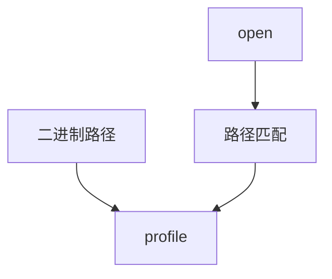

# AppArmor 对照

AppArmor 按程序路径挂配置文件：允许哪些文件、网络、能力，策略对人更像「这个二进制的名单」，而不是全机类型图。

<footer>—— 据 AppArmor 文档；Ubuntu 默认启用实践；[LSM](/cs/lsm-selinux) 为钩子先修</footer>

[SELinux](/cs/lsm-selinux) 的类型系统强大也难写。缺口是 **对照**：同一 LSM 钩，AppArmor 用路径与配置文件。不是谁取代谁的评测文。

## 问题

profile：`/usr/bin/foo` 可 r 某目录、net 等。学习模式记拒绝再生成规则。缺口：路径 vs inode——rename、bind mount、[overlay](/cs/overlayfs) 会让路径策略与真实对象偏离；SELinux 跟 inode 类型走。本课不把 aa-genprof 教程写进正文。

unconfined 默认放行。容器运行时常叠一层 profile。对象仍是 MAC。

## 方法

exec 匹配 profile → 后续钩查名单。对照 SELinux AVC。对照 [capabilities](/cs/linux-capabilities)：profile 可 deny cap。对照 [FUSE](/cs/fuse)：路径在用户 FS 上更飘。

## 机制

AppArmor 降低策略写作成本，换路径语义的裂缝。发行版选谁，课序要求懂两种 MAC 的对象不同。不要写成发行版战争。与 audit：拒绝同样可记。

硬链接、命名空间下的路径可见性是经典坑。

实现上：路径策略在 bind mount 和 namespace 里看见的路径与策略作者想的可能不同。学习模式生成的规则往往过宽。硬链接能让「按路径禁止」漏掉。 读法上只引用[上一课](/cs/lsm-selinux)的结论，不把对象换成训练推理或限价簿。

本课在操作系统进阶的「安全、启动与调试 / 内核安全与启动」课序里，对象是 **AppArmor 对照**。

- 先修只引用，不重导：上一课的结论当公理，本课只补差。
- 五栏不吞并：不把本课写成大模型训练/推理，也不写成限价簿或权重量化。
- 文献用 OSTEP、McKusick、内核文档与具名会议论文；不发明 arXiv 编号。

## 边界

本课不引入 TOMOYO 第三家。不保证嵌入式默认。下一课把拒绝与系统调用记下来：auditd。

版本字段会变，课序钉的是机制对象「AppArmor 对照」，不是某一主线内核的结构体名。
后课默认：MAC 可以是类型或路径。内核审计框架，下一课。

## 小结

- AppArmor：按程序路径的名单型 MAC。
- 与 SELinux 同钩不同策略对象。
- audit 是下一课。
- 出处：AppArmor 文档；LSM；Linux security。
