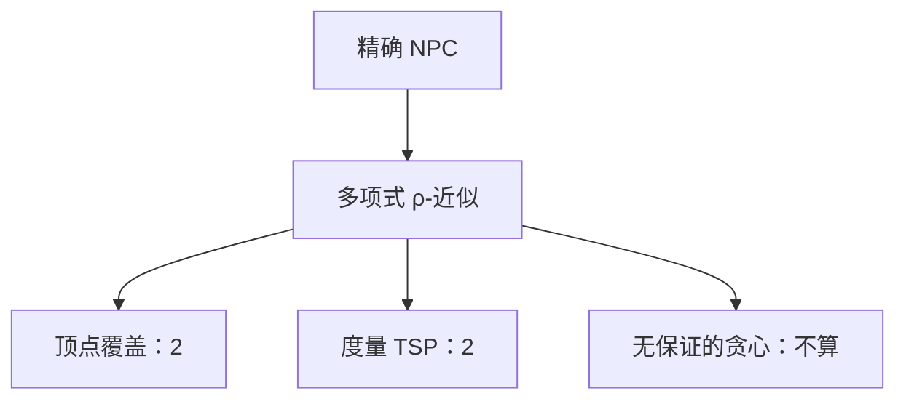

# 近似比

对最小化，$A(x)/OPT(x)\le\rho$；对最大化，$OPT/A\le\rho$。$\rho$ 是算法对一切实例的最坏倍数，不是平均手感。

<footer>—— 据 CLRS 第 35 章；Garey and Johnson, Computers and Intractability, 1979 整理</footer>

上一课[SAT 与 3-SAT](/cs/sat-3sat)把精确可满足钉在 NPC。许多优化版（最小顶点覆盖、度量 TSP）同样难：除非 $P=NP$，没有多项式最优算法。本课不重做归约。缺口是**带保证的次优**：多项式算法输出可行解，比值有界。后课随机化可以是近似的工具，也可以是精确期望；本课先钉确定性比值。

## 问题

顶点覆盖：贪心「反复挑覆盖最多未盖边的点」没有常数比；标准 2-近似是：求极大匹配，两端点都进覆盖——匹配边必须各盖一端，故 $|C|\le 2\,OPT$。度量 TSP：MST 走两遍再捷径，三角不等式给出 2-近似；Christofides 的 $3/2$ 点名不证。缺口是定义 $\rho$-近似，不是再解 3-SAT。

背包有 FPTAS：比值 $1+\varepsilon$、时间随 $1/\varepsilon$ 多项式。本课点名：不是所有 NPC 优化都有 FPTAS；有的连常数比都不存在（在 $P\ne NP$ 下），那是硬度，本课不启用 PCP。

### 比不是「实践中差一倍」

$\rho$ 必须对所有 $x$ 成立。平均实例更好不算证明。也可写绝对误差，主干用比。随机算法的比可以对期望或高概率，下一课再说硬币；本课默认确定性。

CLRS 第 35 章。Garey/Johnson 已区分「精确完全」与启发式。顶点覆盖 2-近似与匹配的关系用[二分图匹配](/cs/bipartite-match)的基数直觉，一般图极大匹配仍多项式。

## 方法

证明可行（覆盖、回路）。证明 $A(x)\le\rho\,OPT(x)$：常用对偶、匹配下界、树的权 $\le OPT$。给出紧实例说明 $\rho$ 不能随便改小。

[贪心正确性](/cs/greedy-correct)要的是 $\rho=1$。本课允许 $\rho\gt 1$，但仍要证。

## 机制

近似把「完全性墙」与「可计算的保证」分开。编译里寄存器着色的启发式通常**没有**本课这种 $\rho$；那是工程，不要回标成本课的定理。也不要把 PTAS/FPTAS 的定义写进每一题。

比值随 $n$ 增长（如 $O(\log n)$ 集合覆盖）仍是近似保证，只是不是常数。点名即可。

## 边界

本课不证不可近似性。不写线性规划舍入的一般理论。后课默认：谈到近似，先写 $\rho$ 与可行。随机化算法的硬币与期望是下一缺口；算法课在随机化之后交给编译。

## 小结

- $\rho$-近似：多项式、可行、最坏比值 $\le\rho$。
- 顶点覆盖 $2$、度量 TSP $2$ 是标准例子；无证明的贪心不算。
- 精确仍 NPC 时，近似是主干出口之一。
- 出处：CLRS 第 35 章；Garey and Johnson, 1979。
