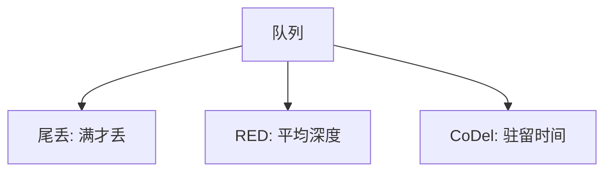

# AQM：RED 与 CoDel

尾丢把队列撑满才说话；主动队列管理提前丢或标记，给 AIMD 信号，并压住延迟。

<footer>—— 据 Floyd and Jacobson, RED, IEEE/ACM ToN 1993；Nichols and Jacobson, CoDel, ACM Queue 2012；RFC 8289 整理</footer>

[RTT 不公平](/cs/cc-fairness-rtt) 与 [incast](/cs/incast) 都怪队列。[上一课](/cs/cc-fairness-rtt) 留下调度器与 AQM 两条路。缺口是 **RED/CoDel**：按平均队列或驻留时间丢/标。本课不把 ECN 协商写完。

## 问题

尾丢 = 满了才丢，信号晚、同步多流一起 MD。RED：平均队列在 min/max 间概率丢。难调，平均队列不是延迟。CoDel：测包的驻留，超过 target 一段时间则丢，参数按时间不是按包数，适配带宽变化。PIE 同类。数据中心浅阈标记更近 DCTCP，公网盒常 CoDel/FQ-CoDel。

不要把 AQM 写成提高 $C$：它管的是延迟与信号时机。

RFC 7567 AQM 建议。RFC 8289 CoDel。本课不把 RED 权值当考试。

### 早期信号换浅延迟

不增加 $C$。RED 按深度难调；CoDel 按驻留。FQ-CoDel 顺带隔离流。极浅 cut-through 无队列可管。

## 方法

对照：尾丢 / RED / CoDel。画：入队 → 测延迟 → 超阈则丢或 CE。与 PFC：一个丢/标，一个暂停，对象都是队列，哲学相反。

方法止于选定对象与对照；机制才说它如何嵌入已有分层与主干课。

## 机制

FQ-CoDel 每流队列再 CoDel，顺带修 RTT 不公平与缓冲膨胀。交换机 ASIC 未必能每流，数据中心用简单阈。卫星：CoDel target 要大于固有 RTT 的排队部分，不能把传播时延当膨胀。P4 可实现自定义 AQM。

同步：随机早期丢减少全局同步，几何上仍 AIMD。

## 边界

本课不引入 L4S 双队列全文。ECN 是下一课。后课默认：AQM 用早期信号换浅延迟；参数以时间为宜。

在极浅缓冲的 cut-through 盒上 AQM 无队列可管。

上一课留下的缺口在本课收口；「AQM：RED 与 CoDel」进入后课词汇表后只引用。文献用来钉对象与边界，不把本课写成该主题的独立综述。下一课[ECN](/cs/ecn)。

## 小结

- 尾丢信号晚且易同步。
- RED 按深度，CoDel 按驻留。
- 不增加容量，改善延迟与反馈。
- 后课只引用本课钉死的对象，不从该领域总问题重开。
- 出处：Floyd–Jacobson, 1993；Nichols–Jacobson；RFC 8289。
