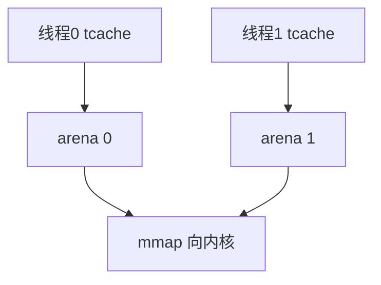

# jemalloc / tcmalloc 竞技场

竞技场让每线程或每核几乎不共享空闲链：分配本地化，减少 malloc 锁，碎片在 arena 之间可能上升。

<footer>—— 据 Evans, jemalloc 论文与手册；Google tcmalloc 设计文档</footer>

[上一课](/cs/malloc-implementation)的单 arena 在多核上抢一把堆锁。缺口是 **jemalloc/tcmalloc 的 arena/tcache**：仍是用户态，不是内核 percpu。

## 问题

glibc 后来也有 per-thread 缓存，但历史上争用严重。jemalloc：多个 arena，线程绑定一个，size class extents。tcmalloc：per-thread cache + 中央页堆。缺口：fork 后子进程继承缓存要清；[memcg](/cs/memcg) 看见的是 RSS，不管 arena 内部空闲；与 [NUMA](/cs/numa-mempolicy) 可每节点 arena。本课不把两个库的调参字典抄完。

extent 在 jemalloc 里是连续虚存管理，类似内核的 vma 但在用户。tcmalloc 的 span 同类。

## 方法

线程首次 malloc：选 arena，填 tcache。释放：先回 tcache，溢出灌回 arena。对照内核 [slab](/cs/slab-allocator) 的 per-cpu 杂志。对照 [RSS 网卡](/cs/rss-multiqueue)：都是为了少跨核。对照 KSM：tcache 里的空闲不一定是零页。

## 机制

竞技场用空间换时间：每 arena 自留空闲，RSS 可能比单堆大，但吞吐高。这是服务端默认换 glibc 的原因之一。不要写成 JVM GC 课。与 MTE：每个 arena 的释放仍要换标签。

调试：工具要懂 tcache，否则「free 了仍 RSS 高」是预期。

实现上：extent 保留虚址但不一定立刻要物理页，RSS 与 VSS 差一截。per-node arena 减少跨 NUMA 原子操作。后台 purge 线程才把空闲还内核。 读法上只引用[上一课](/cs/malloc-implementation)的结论，不把对象换成训练推理或限价簿。

本课在操作系统进阶的「内存进阶 / 回收、迁移与加固」课序里，对象是 **jemalloc / tcmalloc 竞技场**。

- 先修只引用，不重导：上一课的结论当公理，本课只补差。
- 五栏不吞并：不把本课写成大模型训练/推理，也不写成限价簿或权重量化。
- 文献用 OSTEP、McKusick、内核文档与具名会议论文；不发明 arXiv 编号。

## 边界

本课不引入 mimalloc/snmalloc 的全部对照。不保证实时无锁分配器的最坏边界。内存进阶收口于检测工具：ASan 如何用影子内存。

版本字段会变，课序钉的是机制对象「jemalloc / tcmalloc 竞技场」，不是某一主线内核的结构体名。
后课默认：多线程堆用 arena/tcache 减锁。AddressSanitizer 的影子与红区，下一课。

## 小结

- jemalloc/tcmalloc 用多 arena 与线程缓存减锁。
- RSS 可能因空闲保留而更高。
- ASan 机制是下一课。
- 出处：Evans jemalloc；tcmalloc 设计；Wilson 分配综述。
