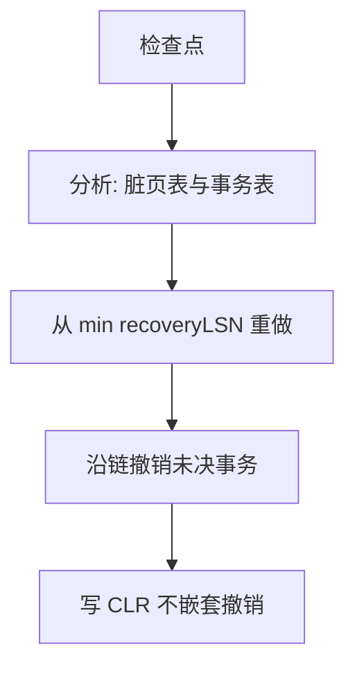

# ARIES 三阶段与 CLR

分析从检查点重建脏页表与事务表；重做从最早脏页 LSN 前滚到日志尾；撤销从尾部按事务链补偿。CLR 让撤销本身可重做且不嵌套撤销。

<footer>—— 据 Mohan, Haderle, Lindsay, Pirahesh and Schwarz, ARIES, TODS 1992；主干 ARIES 直觉的播放补全</footer>

并发续在 [Calvin](/cs/calvin-deterministic) 封口。本课打开恢复与复制续：主干 [ARIES 直觉](/cs/aries-recovery) 已给 steal/no-force 与生理日志。缺口是崩溃后的三阶段与补偿日志记录（CLR）：撤销中途再崩溃时，不能对 UNDO 再 UNDO 成指数。

## 问题

模糊检查点后，页可能落后或超前于数据文件。分析：从最近检查点扫到日志尾，重建 dirty page table（每页 recoveryLSN）与事务表（未决事务 lastLSN）。重做：从 $\min$ recoveryLSN 起，对每条 redo，若页上 pageLSN 更旧则应用——幂等靠 pageLSN。撤销：未决事务沿 prevLSN 链反向，写 CLR（描述已做的补偿），CLR 的 UndoNxtLSN 跳过已补偿段。

缺口是 **CLR 的「永不撤销 CLR」**：再崩溃时重做 CLR 即可，不必嵌套补偿。这是 ARIES 相对朴素 UNDO 的关键。

Mohan et al. TODS 1992。生理：页内物理 redo、逻辑 undo（如 B+ 补偿）。本课不把每条索引 SMO 的 CLR 写完。

## 方法

启动：读控制文件找检查点 → 分析 → redo → undo → 开放新事务。日志尾可能半条记录，要校验。并行 redo 按页分流，页内仍按 LSN 序。

与 doublewrite：重做前先修好撕裂页，否则 pageLSN 不可信。

## 机制

事务回滚（运行时 abort）与崩溃 undo 走同一补偿思想。保存点是链上的标记，rollback to 停在标记。组提交后课把多事务 LSN 一起刷。

复制：物理复制本质是把 redo 送到备库再应用，类似只要 redo 阶段。逻辑复制解成行，后课。

## 边界

本课不讲模糊检查点如何边刷脏边写。也不把影子分页混进 ARIES。日志粒度下一课之后。

后课默认：恢复=分析+redo+undo+CLR。模糊检查点：缩短分析与 redo 起点而不停更新。

pageLSN 是重做幂等的钉子。没有它，生理 redo 不敢下手。

## 小结

- 三阶段重建表、前滚、补偿撤销。
- CLR 使撤销可重做且不递归撤销。
- 模糊检查点下一课。
- 出处：Mohan et al. ARIES, TODS 1992；Gray and Reuter。
