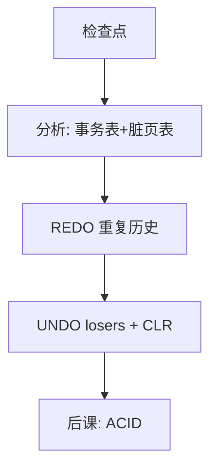

# ARIES 直觉

分析出谁脏、谁未提交；重做直到崩溃前的终点；再补偿回滚未完成事务——补偿本身也进日志。

<footer>—— Mohan, Haderle, Lindsay, Pirahesh and Schwarz, ARIES, ACM TODS 1992</footer>

[上一课](/cs/steal-noforce)钉死日志先行与 pageLSN。本课不重讲 fsync 顺序。缺口是：重启时日志很长、页可能落后或已经超前、回滚可能再次崩溃。ARIES 给出可重复的三阶段：分析、REDO、UNDO，并用补偿日志记录（CLR）保证 UNDO 幂等可中断。

## 问题

只有 WAL 还没有算法。简单「从检查点重放全部」分不清哪些页已经新、哪些事务要撤。缺口不是新的日志格式口号，而是三张表：事务表、脏页表（分析阶段重建），然后**从最小恢复 LSN 重做所有**（重复历史），最后从后往前 UNDO 未提交，每撤一步写 CLR，CLR 指向下一步要撤的日志。

重复历史：REDO 不跳过未提交事务的日志，页状态先回到崩溃瞬间，再 UNDO。这与「只 REDO 已提交」的策略不同，换来的是协议简单、支持 steal。

## 方法

分析：从检查点扫到日志末，得到 loser 事务与脏页的最早 LSN。REDO：从该 LSN 重放，若页上 pageLSN 已更新则跳过。UNDO 按 loser 的 LastLSN 链回退；CLR 的 UndoNxtLSN 让第二次崩溃不必重做已补偿的步骤。本课不把锁表恢复、索引 SMO 日志的全部案例写完，只锁定这三阶段与 CLR。

## 机制

生理日志：以页为 REDO 单位，UNDO 可以是逻辑操作（如删除一条索引项）。这样 B+ 分裂不必在 REDO 时重演复杂路径，只要页内容回到日志所写。检查点把脏页表抄进日志，缩短分析。本课与[缓冲](/cs/buffer-dirty)对齐：换出脏页合法（steal），因为 UNDO 靠日志里的旧值或逻辑逆操作。

生理日志让索引 SMO 不必在 REDO 时重演分裂路径，只要页映像回到日志所写。

## 边界

ARIES 不是唯一恢复方案。影子页、写时复制文件系统走另一条路。本课也不覆盖分布式恢复、两阶段提交的协调器日志——那是[两阶段提交](/cs/two-pc)。介质故障要归档日志与备份，不是一次重启三阶段能单独解决的。

模糊检查点允许检查点期间继续更新，分析阶段必须读到检查点结束之后的日志，这是为了缩短停机，不是省略 REDO。后课默认：本地崩溃后库能回到「已提交都在、未提交都像没发生」。事务的四个字母如何分工，下一课才命名。

CLR 把 UNDO 变成可重做的 REDO 信息，第二次崩溃不会撤过头。这是「可中断回滚」的全部要点。

## 小结
- 分析重建的脏页表决定 REDO 起点；检查点越勤，分析越短。
- 后课 ACID 把这套恢复说成用户能理解的原子与持久。

- WAL 给顺序；ARIES 给出分析、重复历史 REDO、带 CLR 的 UNDO。
- steal/no-force 因此可实现，而不把半成品提交出去。
- 事务性质的用户说法（ACID）是后课缺口。
- 出处：Mohan et al., *TODS* 17(1), 1992；Gray and Reuter。
