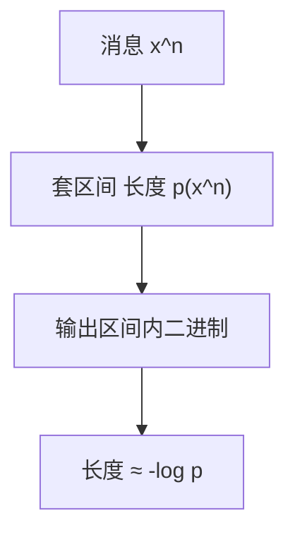

# 算术编码

把整条消息映到 $[0,1)$ 里一段长度为 $p(x^n)$ 的区间，再输出区间里的一个二进制小数；码长可以是分数比特，逼近 $H$ 不必等到巨型符号表。

<footer>—— 据 Rissanen；Witten, Neal and Cleary, 1987；Cover and Thomas 整理</footer>

上一课[Huffman](/cs/huffman-coding) 的码长是整数，单符号离 $H$ 可差 1。缺口是**算术编码**：用区间套表示消息，输出长度 $\approx -\log p(x^n)$。不重做 Huffman 树。

## 问题

按 $p$ 把 $[0,1)$ 划成子区间，读一个符号就进入对应子区间，长度乘 $p(a)$。最终区间长度 $=p(x^n)$，其中任选一点的二进制展开约 $-\log p(x^n)$ 比特即可唯一标识（与相邻区间分开）。期望码长 $\to H$。自适应：边读边更新 $p$，不必事先扫描。

实现用整数缩放代替无限精度，本课要区间图像，不写进位细节。

### 不是「把符号当数字相加」

名字里的 arithmetic 是区间端点的加减乘。与后课数论模运算无关。也不要把浮点误差当成定理的一部分——定理在精确实数上，工程用整数。

Rissanen 算术编码；Witten–Neal–Cleary 的 CACM 实现。Cover–Thomas 把它当 Shannon 码的极限。专利史曾影响部署，本课不谈。

## 方法

画三步套区间的数轴。对比 Huffman：同一 $p$，算术对整句记账，Huffman 对每个符号付整比特。指出：译码端必须共享同一 $p$ 或同一自适应规则，否则区间对不齐——与密码无关，是模型约定。

## 机制

信源编码定理的可达半边，算术给出建设性、无需 $n$ 元组爆炸。LZ 下一课连 $p$ 都不显式要，用字典。本课仍假设模型（静态或自适应计数）。

前缀：输出可以设计成前缀码（加结束标记）。流式：区间端点的高位稳定即可先发出。

发送端不必等整句结束：一旦区间高位稳定即可输出。结束符或显式长度防止译码多读。自适应计数等价于「边走边改划分」；$p$ 估计不足时 $D(p\|\hat p)$ 就是多付的比特，KL 课再写。与模运算无关：端点是有理数缩放，不是 $\mathbb{Z}/n\mathbb{Z}$。

## 边界

本课不写整数实现的 renormalization 全文，不引入 ANS。不把大模型的 token 概率请进来当主例子——对象仍是有限字母表信源。后课默认：分数比特码长用区间。下一课无模型字典：LZ77/78。

区间长度 $p(x^n)$ 把整句的 $-\log p$ 一次付清，所以不必等 $n$ 元组 Huffman 表。编解码模型不一致则区间错位，这是同步约定，不是保密。

上一课留下的缺口在本课收口；「算术编码」进入后课词汇表后只引用。文献用来钉对象与边界，不把本课写成该主题的独立综述。

## 小结

- 消息 $\leftrightarrow$ 长度 $p(x^n)$ 的区间；输出其二进制。
- 期望码长逼近 $H$，打破单符号整数限制。
- 编解码必须共享模型。
- 出处：Rissanen；Witten, Neal and Cleary, 1987；Cover and Thomas。
