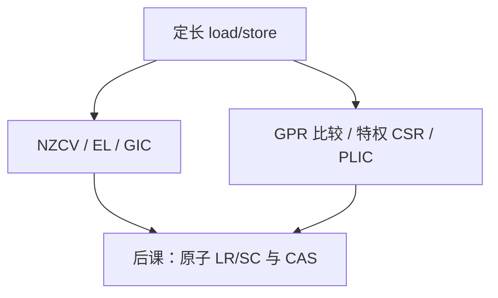

# ARM 对 RISC-V

  
两者都是定长 load/store RISC；差别在条件码、压缩、向量、特权命名与授权模式，而不是「一个 RISC 一个不是」。

  <footer>—— 据 ARM Architecture Reference Manual；The RISC-V Instruction Set Manual；Hennessy and Patterson, CA:AQA 整理</footer>

[上一课](/cs/aarch64-isa)钉了 A64。[RISC-V 整数](/cs/riscv-int-isa) 已是本栏主干。缺口是**对照表**：避免后课原子、fence、页表各说各话时读者以为在学第三种哲学。

## 问题

相同：运算在寄存器、访存单独、定长基础指令、特权与用户分离。不同：ARM 用 NZCV 与条件分支编码；RISC-V 比较结果进通用寄存器再分支。ARM 商业授权核；RISC-V 开放 ISA、核多家。压缩：ARM 有历史 Thumb，A64 不定长；RISC-V `C` 扩展 16 位混长（后课）。向量：ARM SVE 与 RISC-V RVV 都是可变长，后课分讲。缺口不是再介绍 A64 寄存器，而是这些**选择的组成后果**。

页表：ARM 多级与 ASIDs；RISC-V Sv39 后课。虚拟化：ARM EL2 vs RISC-V H 扩展。

### 对照不是「谁更快」

性能是微结构、工艺、[功耗墙](/cs/dennard-power-wall) 与编译器。ISA 对照课不宣布基准冠军。把课写成选购指南，会滑出系统栈。

两份官方手册 + CA:AQA 的 RISC 章节。本课用差异点列表，不抄指令全表。

## 方法

列一张心智表：寄存器数、零寄存器、链接寄存器（`x30` vs `ra`）、栈指针是否特殊、系统调用指令（`svc` vs `ecall`）、内存模型（ARM 弱、RISC-V 弱，fence 课）。ABI：AAPCS64 vs RISC-V psABI，最后一课收。

教学 CPU：RISC-V 更易画单周期；ARM 教材同样可画，字段不同。

## 机制

原子：ARM 有 `ldxr/stxr` 与后来的 LSE `cas`；RISC-V `A` 扩展 LR/SC 与 AMO。下一课专讲。SIMD 再下一组。本课防止「ARM=CISC」的谣言（那是 x86）。

## 边界

本课不比较授权费，不预测生态。不把 MIPS/POWER 拉进来冲淡。不写 DSP 定点指令全集。

后课默认：ARM 与 RISC-V 同属 RISC 家族；差异在条件码、压缩、特权与扩展哲学。

## 小结

- 都是定长 load/store；x86 才是变长 CISC 外壳。
- 条件码 vs 比较进寄存器；特权命名不同。
- 速度不由本课裁定。
- 出处：ARM ARM；RISC-V ISA Manual；Hennessy and Patterson, CA:AQA。
