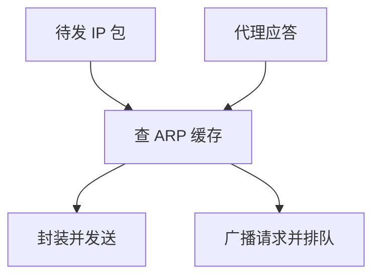

# ARP 缓存与代理

解析结果必须缓存才扛得住广播；超时与代理改变的是表项从哪来，不是 IP 到 MAC 的那道翻译。

<footer>—— 据 Plummer, RFC 826；Kurose and Ross 对 ARP 表与代理 ARP 的整理</footer>

[上一课](/cs/arp)给出同一链路上的 IP→MAC：广播问、单播答。本课不重写请求格式。缺口是表：每包都广播会淹没[VLAN](/cs/vlan) 里的广播域；表项过期或被他人改写，下一跳会发错人。代理 ARP 则让路由器替一整段地址回答。本课不把子网掩码写完。

## 问题

ARP 成功一次之后，后续帧应直接封装。缓存：IP 映射到 MAC，带生存时间。无超时则主机搬家后流量仍打到旧口；过短则广播风暴。Gratuitous ARP 用于宣告与冲突检测。代理：路由器对「不在本机但可达」的 IP 回答自己的 MAC，把本应跨网的包先拉过来再路由——曾用来把主机从子网细节里藏起来。缺口是**表的维护合同**，不是新的帧类型。

缓存没有认证。后到的应答可以覆盖表项。防御是信任边界：只在链路上使用 ARP、静态表用于关键网关、后课用 NDP 与安全扩展对照，而不是在本课写攻击步骤。

## 方法

发送路径：查缓存；未命中则排队并广播请求，填表后再封装。收应答：更新或插入，刷新计时。代理 ARP 在路由器开启时，对特定前缀代答；今日默认少用，因为和 CIDR 边界纠缠、排障困难。交换机仍把 ARP 请求当广播；缓存命中之后的单播帧才走 MAC 表。

## 机制

缓存把一跳翻译从控制平面（广播）变成数据平面（查表），让 [DMA](/cs/io-dma) 出去的帧不必每次泛洪。代理把「是否同一链路」从主机判断部分上收到路由器，模糊了后课子网的边界——这正是下一课必须钉掩码的原因。端到端仍不在 ARP：表填对只保证这一跳 MAC 对。

## 边界

本课不引入 NDP 选项清单，不把 ARP 探测当安全协议。静态 ARP 是运维钉死网关，不是密码学绑定。哪些地址算同一链路、要不要问网关，下一课 [IP 编址与子网](/cs/ip-subnet)。

后课默认：同一链路上翻译结果会缓存并过期。没有掩码，就还不知道该问目的还是问默认网关。

## 小结

- ARP 表有超时；命中后不再广播。
- 代理 ARP 让路由器代答，模糊直连边界。
- 子网决定问谁，下一课。
- 出处：RFC 826；Kurose and Ross。
