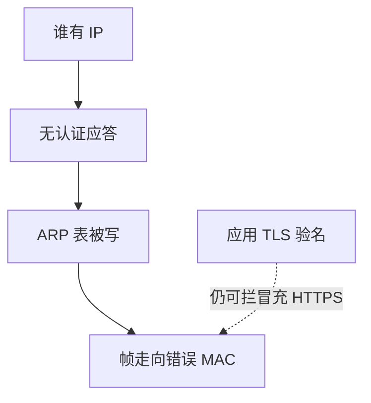

# ARP 欺骗

以太网用 ARP 问「谁有这个 IP」。谁先答、答得勤，谁就能当网关。这是局域网的映射欺骗，不是路由协议的全球问题。

<footer>—— 据 Plummer, RFC 826；对照 Cisco/IANA 对动态 ARP 检查一类防御</footer>

## 定位

上一课[DNS 投毒](/cs/dns-cache-poisoning)在三层之上。缺口是**同网段**：ARP 无认证。本课收机制与交换机侧防御，不给欺骗操作步骤。

后课默认已经读完本课钉下的合同，只补差，不从该领域第一性原理重开。

## 问题

主机把 MAC 写入 ARP 表后，帧发往攻击者网卡，再转发则成中间人。对 TLS 仍要验证书；明文 HTTP 与内部无 TLS 服务会直接泄漏。缺口是二层信任假设，不是再讲以太网帧。

### 静态表与 DAI

关键主机可静态 ARP；交换机可做动态 ARP 检查绑定 DHCP 侦听。那是网络作业，不是密码学。

RFC 826。本课禁止 ARP 欺骗教程。无线客户端隔离是另一缓解。

## 方法

陈述：无认证的请求/应答、缓存覆盖。防御：分段、DAI、最小二层域、应用全 TLS。对照 VPN：远程用户进同一 L2 广播域会放大这条。

图中节点是本课的机制骨架；课程不把图展开成可运行的攻击步骤。

## 机制

信道单元收口：从证书、无线、DNS 到 ARP，每一层都有「映射可被骗」。下一课序身份：应用如何发令牌——JWT 常把映射问题换成签名问题，然后自己关验签。

前提写进合同之后，游戏外的误用只当失败模式点名，不在本课写成操作程序。

## 边界

本课不写交换机 CAM 溢出步骤。JWT 下一课：令牌合同。

## 小结

- DNS 骗名字；ARP 骗同网段 MAC。
- 无认证映射；防御在分段与检查，不在更长 AES。
- 应用 TLS 仍是安全带。
- 下一课序：JWT 陷阱。
- 出处：RFC 826；对照 Anderson 对链路层信任；NIST 对分段的讨论。
