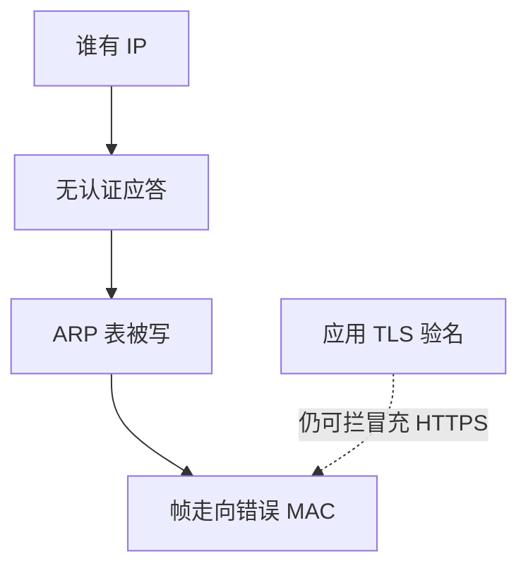
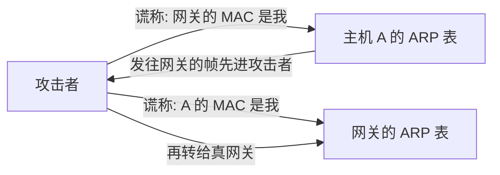

# ARP 欺骗

以太网用 ARP 问「谁有这个 IP」。谁先答、答得勤，谁就能当网关。这是局域网的映射欺骗，不是路由协议的全球问题。

<footer>—— 据 Plummer, RFC 826；对照 Cisco/IANA 对动态 ARP 检查一类防御</footer>

上一课[DNS 投毒](/cs/dns-cache-poisoning)在三层之上。缺口是**同网段**：ARP 无认证。本课收机制与交换机侧防御，不给欺骗操作步骤。

后课默认已经读完本课钉下的合同，只补差，不从该领域第一性原理重开。

## 问题

主机把 MAC 写入 ARP 表后，帧发往攻击者网卡，再转发则成中间人。对 TLS 仍要验证书；明文 HTTP 与内部无 TLS 服务会直接泄漏。缺口是二层信任假设，不是再讲以太网帧。

术语翻译：中间人（MITM）指攻击者卡在两台主机的必经之路上——不破译你的密码，而是站在门口把每张明信片抄一遍再转交。ARP 欺骗正是链路层里最便宜的「占路口」手段。

### 静态表与 DAI

关键主机可静态 ARP；交换机可做动态 ARP 检查绑定 DHCP 侦听。那是网络作业，不是密码学。

RFC 826。本课禁止 ARP 欺骗教程。无线客户端隔离是另一缓解。

## 方法

陈述：无认证的请求/应答、缓存覆盖。防御：分段、DAI、最小二层域、应用全 TLS。对照 VPN：远程用户进同一 L2 广播域会放大这条。

```mermaid
flowchart TD
  REQ["谁有 IP"] --> ANS["无认证应答"]
  ANS --> TAB["ARP 表被写"]
  TAB --> MITM["帧走向错误 MAC"]
  TLS["应用 TLS 验名"] -.->|"仍可拦冒充 HTTPS"| MITM
```

## 机制

信道单元收口：从证书、无线、DNS 到 ARP，每一层都有「映射可被骗」。下一课序身份：应用如何发令牌——JWT 常把映射问题换成签名问题，然后自己关验签。

常见误区：初学者容易以为「换更强的加密算法」就能防 ARP 欺骗。AES 再强，也架不住你把密钥交给了冒充的网关——病灶是「谁是谁」的映射没有认证，防御要对症：收窄广播域、交换机 DAI、应用层全 TLS。

```mermaid
flowchart LR
  ATK["攻击者"] -->|"谎称: 网关的 MAC 是我"| A["主机 A 的 ARP 表"]
  ATK -->|"谎称: A 的 MAC 是我"| GW["网关的 ARP 表"]
  A -->|"发往网关的帧先进攻击者"| ATK
  ATK -->|"再转给真网关"| GW
```

## 边界

本课不写交换机 CAM 溢出步骤。JWT 下一课：令牌合同。

为什么重要：只骗一边，攻击者多看一台主机的流量；同时骗主机和网关两边，它就坐上中转位，全段明文一网打尽。这正是「最小二层域」的价值——广播域越小，能被骗进同一场戏的角色越少。

## 小结

- DNS 骗名字；ARP 骗同网段 MAC。
- 无认证映射；防御在分段与检查，不在更长 AES。
- 应用 TLS 仍是安全带。
- 下一课序：JWT 陷阱。
- 出处：RFC 826；对照 Anderson 对链路层信任；NIST 对分段的讨论。
