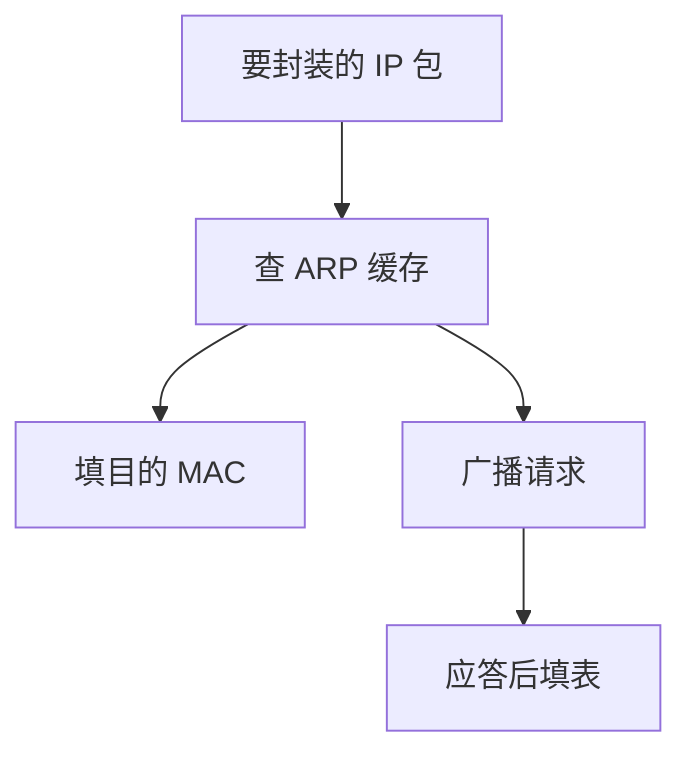

# ARP

ARP 在同一链路上问：这个 IP 对应哪一个 MAC？回答后才能把帧的目的地址填对。

<footer>—— 据 Plummer, RFC 826, An Ethernet Address Resolution Protocol, 1982 整理</footer>

[上一课](/cs/spanning-tree)让广播域在树上看可转发。[帧与 MAC](/cs/frame-mac) 要目的硬件地址；[分层](/cs/spanning-tree)已经预告网络层会有主机号。缺口是同一链路上 **IP → MAC** 的解析。本课是 ARP（RFC 826），不把子网掩码写完。

## 问题

主机要发 IP 包给「下一跳」（可能就是目的主机）。链路只认 MAC。若静态配置每台邻居，无法应对热插拔。ARP：广播「谁拥有此 IP」，拥有者单播回自己的 MAC；双方缓存。缺口不是路由算法，而是已连通链路上的翻译表。

ARP 无认证，应答可被冒充；安全课再谈，本课只钉解析。

缓存有超时。代理 ARP 曾让路由器替整网回答，今日少用。IPv6 改用邻居发现，对照在 IPv6 课。

## 方法

发送前查 ARP 表；无则广播请求，可先排队 IP 包。收到应答后填表，封装帧。Gratuitous ARP 用于宣告或检测冲突。交换机对 ARP 请求当广播泛洪，对单播应答则按 MAC 表走——生成树保证这不会转圈。

## 机制

ARP 把网络层名字临时接到链路层名字，让[DMA](/cs/io-dma) 出去的帧能被正确网卡过滤。它是一跳协议：过了路由器，下一跳要重新 ARP，MAC 会换。端到端论证：ARP 不保证 IP 包到达最终主机，只保证「这一跳的帧头填对」。

与进程：ARP 在内核网络栈，不经用户[信号](/cs/signals)；用户只看见套接字发送成功或主机不可达（后课 ICMP）。

## 边界

本课不引入 NDP 选项清单，不把 InfiniBand 的 GID 解析混进来。也不把静态 ARP 当安全方案。IP 自己如何编号、何为子网，下一课；没有子网，就还不知道「是否同一链路、要不要 ARP 目的还是 ARP 网关」。

同一 IP 被两台主机声明时，后到的应答会污染缓存。检测靠 gratuitous；本课不把防御写成配置指南。

后课默认：同一链路上能把 IP 译成 MAC。哪些 IP 算同一链路，下一课编址与子网。

## 小结

- ARP 在以太网链路上解析 IP 到 MAC（RFC 826）。
- 缓存、广播请求、单播应答；每跳可重新解析。
- 子网决定问谁，是下一课。
- 出处：RFC 826；Kurose and Ross；Tanenbaum *Computer Networks*。
