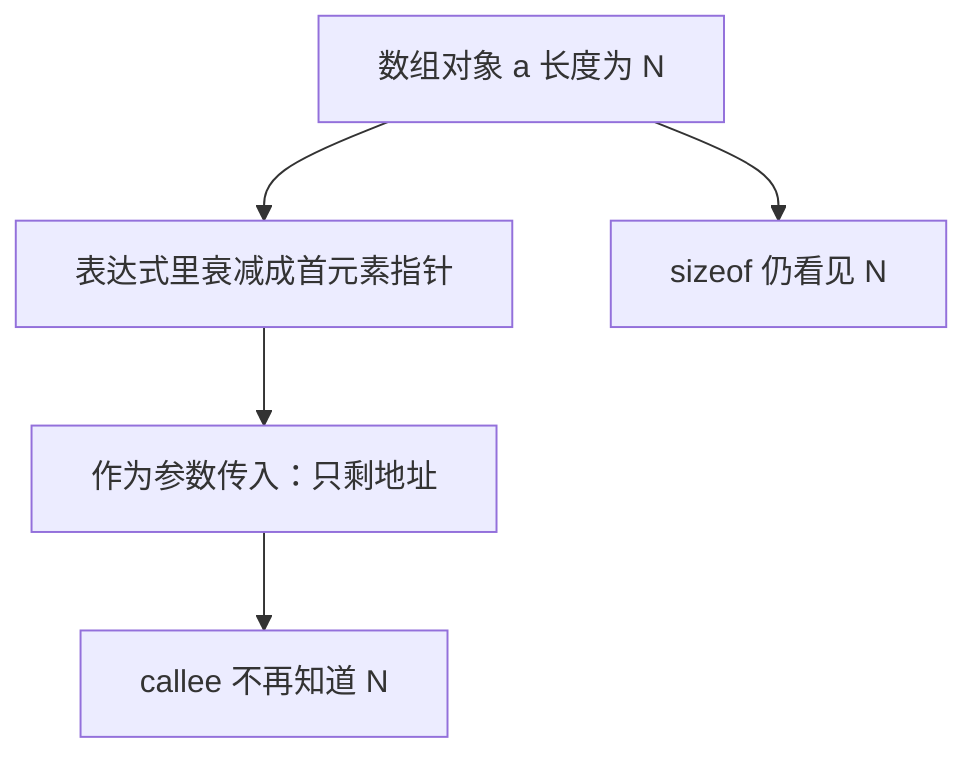

# 数组与指针衰减

数组是一块连续的对象；在多数表达式里，它的名字会变成指向第一个元素的指针——长度信息在这一步丢掉。

<footer>—— 据 Kernighan & Ritchie, The C Programming Language, 2nd ed.；ISO/IEC 9899 整理</footer>

上一课[指针与别名](/cs/pointer-alias)钉死了：指针是对象地址，可以制造共享视图。本课不重讲别名，也不从「数组是对象」的数学定义另起。缺口是：声明 `int a[10]` 得到的是数组对象，**为什么 `a` 常常用起来像指针，而 `sizeof(a)` 又不是指针的大小**？传参时长度如何丢失。

## 问题

数组对象占连续 `n` 个元素的存储，下标 `a[i]` 定义为 `*(a+i)`。在需要指针的上下文里，数组名衰减为指向首元素的指针。函数参数写成 `int a[]` 或 `int *a` 对调用方是同一件事：传入的是地址，不是数组拷贝。缺口因此不是下标语法，而是**对象与衰减后的指针不是同一种东西**——长度只活在数组类型里，一衰减就没了。

这解释了为何 C 函数不能靠参数类型恢复 `n`，必须另传长度或约定哨兵。也解释了为何嵌套数组、指针数组、指向数组的指针三种声明不能靠语感互换。本课只处理一维衰减；结构体里嵌数组、多维布局留给[结构体内存布局](/cs/struct-layout)。

### `&a` 与 `a` 不是同一类指针

`a` 衰减后类型是「指向元素」；`&a` 是「指向整个数组」，步长是整个数组的大小。两者数值上常常相同，加法一次之后就分叉。把它们当成「都是首地址」会在指针算术里越界而不自知。`sizeof` 对数组给出字节数，对衰减后的指针给出指针宽度——同一记号在不同上下文量的是不同对象。

K&R 把数组与指针的互换写成 C 的核心习惯，同时警告：作为函数参数时数组已经不是数组。ISO C 把衰减写成表达式转换规则，例外是 `sizeof`、`_Alignof` 与 `&`。

## 方法

声明 `T a[N]`：对象大小 `N * sizeof(T)`，对齐随 `T`。表达式 `a` 在非常见例外下变成 `(T *)&a[0]`。`a[i]` 与 `i[a]` 因加法交换而合法，但本课不提倡后者。字符串字面量有静态数组类型，传给 `char *` 时同样衰减；改字面量是 UB。

指针算术：`p+1` 跳过一个元素，不是一个字节（除非元素就是字节）。越界形成的指针，即使尚未解引用，也只允许指向「末元素之后那一个」位置；再出去就是 UB。这与上一课「指针指向活对象」接上：数组提供一段连续活对象，指针在这段里移动。

多维数组作为参数写成 `T a[][N]` 时，内层长度必须出现在类型里，这样指针算术才知道一行多宽；最外层仍衰减。这常被误写成 `T **`，后者要求先有一层指针对象。本课把这一区别留给读声明的人：数组的数组连续，指针的指针中间有指针存储。后课结构体可以用「指针加长度」明确表达，避开衰减丢 $N$ 的问题——那是用布局换回类型里失去的长度。

## 机制

衰减让数组能廉价地交给函数：只传地址，不拷贝。代价是 callee 失去上界。任何「根据参数类型检查越界」在 C 里都做不到，除非把数组包进结构体、让类型带上 `N`。后课结构体布局会用到：结构体作为参数按值拷贝，其中的数组成员一起走，不衰减；一旦取出数组成员再传入另一个函数，衰减再次发生。

多维数组是「数组的数组」。`a[i]` 先得到一行（仍是数组），再衰减成该行首元素指针。不要把它想象成「指针的指针」：后者是两层独立对象，中间还有一次解引用。混用会在别名与释放时把所有权搞错。

字符串与 `char` 数组是同一规则的常用实例：字面量在静态区，传给函数时变成 `char *`，长度靠 `\0` 而不是类型。这并不使数组「等于指针」——你仍不能对数组对象赋值，也不能让数组从函数按值返回整块。指针可以重新指向别的对象，数组名在非衰减上下文里仍是那一块连续存储。后课结构体把数组当成员嵌进去时，衰减被推迟到取出该成员的表达式，布局课会用到这条延迟。

## 边界

本课不讲柔性数组成员、变长数组的全部实现差异。对齐与填充下一课才出现。后课默认：数组是连续对象；多数表达式里名字变成首元素指针；作为参数传入时长度必须另给。

## 小结

- 数组对象带长度；衰减后只剩指向首元素的指针。
- 函数参数 `T a[]` 与 `T *a` 等价，都不拷贝数组。
- `&a` 与 `a` 类型不同，指针算术步长不同。
- 下一课把连续布局从数组推广到结构体字段。
- 出处：K&R 数组与指针；ISO C 数组到指针的转换规则。
