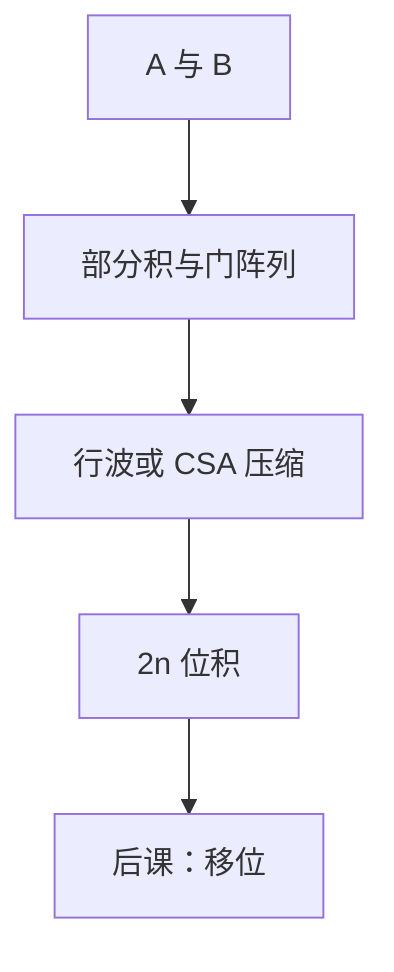

# 阵列乘法

乘法是部分积再相加；阵列把每一位乘与一排加法器铺在平面上，延迟随字长涨，不再假装「一次 ALU 就完」。

<footer>—— 据 Harris and Harris, Digital Design and Computer Architecture；Patterson and Hennessy, Computer Organization and Design (RISC-V) 整理</footer>

上一课[进位选择](/cs/carry-select)把加法器的延迟–面积档次说清。本课不重画 CLA，也不从 Booth 编码史另起。缺口是：[加法器课](/cs/adder-cla)明确把乘法排除在外。整数乘是重复加或**部分积阵列**，关键路径比一次加长得多。

## 问题

无符号：$p=\sum_i a_i b\cdot 2^i$。每一位 $a_i$ 决定是否把 $b$ 左移 $i$ 位加入。缺口是电路：移位是接线，与是部分积，再把 $n$ 个 $n$ 位数加起来。行波阵列：每一行一个加法器，延迟 $\Theta(n^2)$ 门级；用进位保留（CSA）可把加法树变浅，本课点到，不把华莱士树画完。

有符号补码乘要符号扩展或 Booth，本课以无符号钉结构。RV32M 的 `mul` 在组成课可当独立单元，不必塞进单周期同一 $T$。

### 阵列不是「ALU 再循环 $n$ 拍」的同一张图

多周期可以用 ALU 移位加，CPI 为 $\Theta(n)$。阵列是组合（或一拍组合）硬件，面积换时间。把两种实现混成一种「乘法器」，后课单周期图会误把 `mul` 画进与 `add` 同深的框。

Harris 用阵列与树形压缩。Patterson/Hennessy 把乘除放到整数乘除单元或慢路径。本课不讲浮点对阶乘法。

## 方法

部分积：$pp_{i,j}=a_i\land b_j$，按权对齐。阵列：第 $i$ 行把 $pp_{i,*}$ 加到部分和上。输出 $2n$ 位。关键路径沿最右进位再向下行，或沿 CSA+末级 CLA。

## 机制

后课 ALU 数据通路默认不含全宽乘；`mul` 另口或另拍。移位下一课单独成块，因为 `sll` 是 ISA 常客，比乘浅。本课只承认：乘的组合深度通常大于加，关键路径分析必须分开。

## 边界

本课不实现除法恢复/不恢复、不讲 DSP 块。不把矩阵乘、MAC 阵列提前到体系结构课以外。

后课默认：整数乘是部分积再加，延迟远大于一次 CLA；教学 CPU 可以没有组合乘法器。

## 小结

- 乘 = 部分积 + 多操作数加。
- 阵列面积大、路径长；多周期移位加是另一实现。
- 有符号与 Booth 不在本课展开。
- 出处：Harris and Harris；Patterson and Hennessy, COD (RISC-V)。
