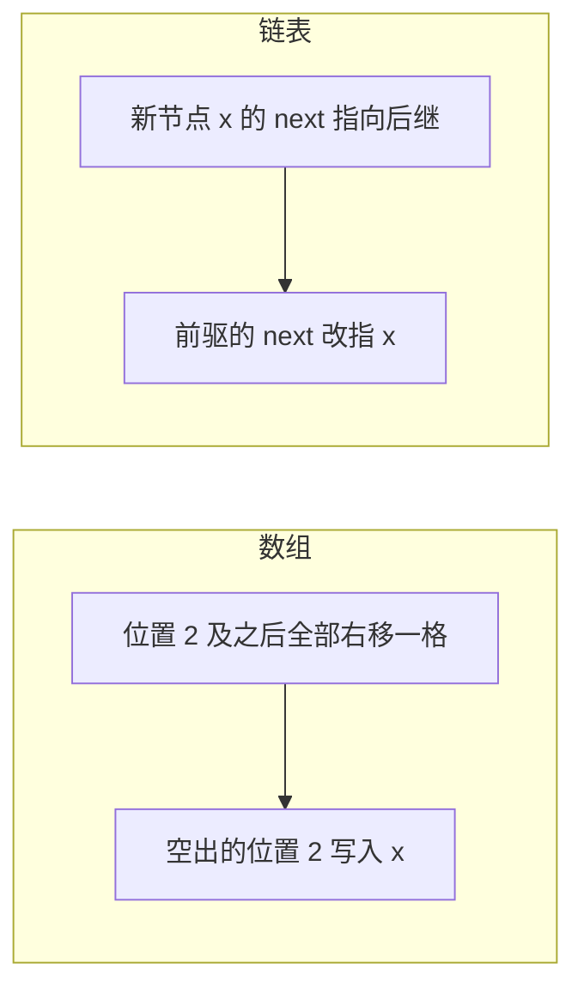

# 数组与随机访问

下标到地址是一次乘加；RAM 模型里那是 $O(1)$，前提是元素连续且大小已知。

<footer>—— 据 Knuth, The Art of Computer Programming 卷 1；Cormen, Leiserson, Rivest and Stein 整理</footer>

[上一课](/cs/adt-cost)把结构写成操作加代价，还没有任何一种布局。[比特作为区分](/cs/bit-as-distinction)与[进制与位权](/cs/positional-notation)已经能把下标写成整数。[SRAM 与 DRAM 阵列](/cs/memory-array-sram-dram)按地址读字。[调用约定与栈](/cs/calling-convention-stack)里的栈槽其实已经是数组片段。本课不重讲 ADT 合同。缺口是第一种表示：连续元素 + 按下标 $O(1)$ 取。

## 问题

集合的「第 $i$ 个」若每次从头数，代价随 $i$ 涨。硬件却已经提供按物理地址的常数时间字访问（cache 命中时）。缺口是把 ADT 的下标映射到地址：$\mathrm{addr}(A[i]) = \mathrm{base} + i \times \mathrm{size}$。本课只钉静态长度或长度存在另处的定长数组，不讨论自动扩容——那是摊还课。

插入到中间要搬移后续元素，最坏 $\Theta(n)$。合同必须把「按下标读」和「在中间插入」分开写，不能都叫 $O(1)$。

RAM 模型假定任意字地址 $O(1)$。层次存储器下这是命中时的近似；行对齐的顺序扫才吃满空间局部性。

## 方法

表示：一块连续虚拟地址，元素同宽。读写下标 $i$ 合法当且仅当 $0\le i\lt n$。构造分配 $n\times\mathrm{size}$ 字节。随机访问 $\Theta(1)$ 步；顺序扫 $\Theta(n)$ 步且对 cache 友好。

把地址公式代入具体数：基址取 0x1000、每个元素 8 字节时，$A[5]$ 的地址就是 $0\mathrm{x}1000 + 5\times 8 = 0\mathrm{x}1028$，一次乘加直达，完全不用从 $A[0]$ 数过去——这就是「随机」两个字的含义：访问第几个都一样快。

多维数组按行主序或列主序展开成一维；跨大步长会打穿[局部性原理](/cs/locality-principle)，渐近步数仍 $\Theta(1)$ 每次访问。这正是合同里「步」与「常数」要分开的理由。

## 机制

数组把字典里「已知下标」这一特例做到最优。未知键的查找仍要扫，无序时 $\Theta(n)$。后课链表用指针换「中间插入 $\Theta(1)$」（已有前驱时），代价是丢掉随机访问和局部性。

同一个「在位置 2 插入 $x$」，两种结构付出的代价完全不同：

直觉类比：数组像一排编号连续的储物柜，报出编号直接走到对应柜子；链表像寻宝游戏，每个盒子里只藏着下一个盒子的位置——想拿第 100 件东西就得挨个开 100 次盒子。

常见误区：初学者容易以为「随机访问 $\Theta(1)$」等于「数组干什么都是 $\Theta(1)$」。实际上在中间插入或删除一个元素要搬动后面所有元素，$n$ 很大时这一步才是开销大头；测性能时别只测按下标读写。

边界检查不是 ISA 默认：越界是安全课才会强制的，本课在合同里写前置条件，实现可以省略检查。定长构造失败只发生在分配阶段，不发生在下标算术里。

## 边界

本课不引入动态数组的倍增，不把切片当成独立 ADT。也不把数组写成「唯一的表」：关联查找是树与散列的缺口。NUMA 上大数组可能跨节点，地址计算仍是乘加，延迟不是 $O(1)$ 纳秒。

后课默认：谈到连续表，按下标读写 $\Theta(1)$ 步；中间插入需搬移。链表用来买另一组代价。

## 小结

- 连续布局把下标变成基址加偏移，RAM 下随机访问 $\Theta(1)$。
- 中间插入 $\Theta(n)$；顺序扫吃空间局部性。
- 链表用指针换插入，下一课把局部性代价说清。
- 倍增扩容不在本课；按下标仍假定长度已知。
- 出处：Knuth, *TAOCP* 卷 1；Cormen et al. 数组作为表的表示。
