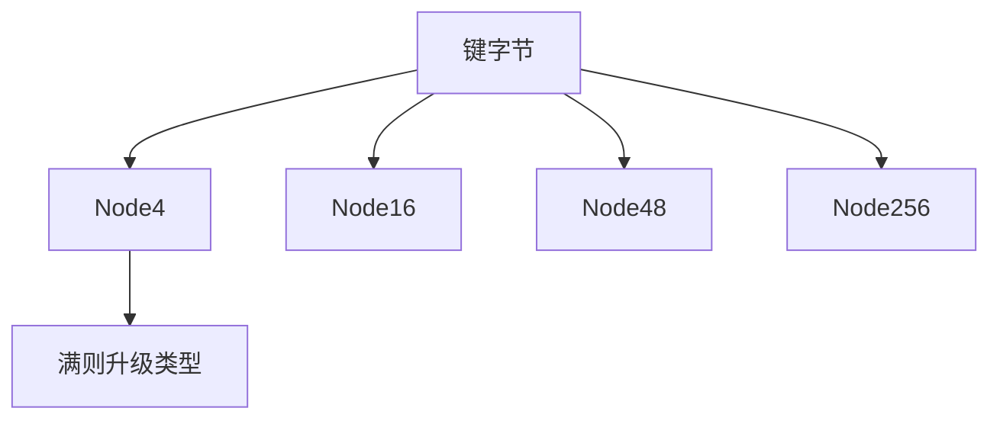

# ART 自适应基数树

节点类型随扇出变：4、16、48、256；前缀压缩吃掉一元路径。查找沿真实键字节走，不先搅成哈希。

<footer>—— 据 Leis, Kemper and Neumann, The Adaptive Radix Tree: ARTful Indexing for Main-Memory Databases, ICDE 2013 整理</footer>

[上一课](/cs/hamt) 用哈希比特，丢失键序。[Trie](/cs/trie) 固定 256 数组浪费。[B+](/cs/bplus-split) 面向页。[跳表](/cs/skip-list) 期望对数比较整键。本课不路径复制整课。缺口是 ART：内存数据库索引，按字节基数、节点形态自适应。

## 问题

内存中有序索引：比较树 $\log n$ 次整键比较；哈希表不保序。基数树按字节 $O(|key|)$，但节点浪费。ART：Node4 存少量键字节+指针；Node16 SIMD 比较；Node48 用 256 字节索引进 48 指针；Node256 直接数组。lazy expansion 与路径压缩合并一元。缺口是**用节点类型匹配实际扇出**，保持字节序（从而范围扫描）。

Leis, Kemper, Neumann, *ICDE* 2013。整数键可大端字节化以保持序。本课不把论文实验表抄进来。

## 方法

查找：从根吃前缀，再按下一字节选孩子。插入：节点满则升级类型（4→16→48→256）。删除可降级。范围：有序孩子迭代。并发：乐观锁或 ROWEX 变体，本课点名不写完。

与 HAMT：ART 保序、无哈希；HAMT 持久更容易、无序。与后缀树：ART 是字典不是全部后缀索引。

字符串课序结束。下一单元概率结构：从通用散列族开始，给后面草图与过滤器提供碰撞合同。

## 机制

缓存：小节点密，256 节点吃一页级缓存线若干。前缀压缩使短分支不建多层。键必须能看成字节串；比较器自定义难塞进基数。

不要把 ART 写成 Transformer 词表；就是内存有序映射。

## 边界

本课不把 ART 与 Bw-tree 对比写长。磁盘仍 B+。哈希族与完美散列是下一课序，不在 ART 里重讲。

后课默认：内存字节键有序索引可用 ART。碰撞概率的系统合同从通用散列讲起。

## 小结

- ART：自适应扇出的字节基数树，保序。
- 节点 4/16/48/256 + 前缀压缩。
- 字符串结构课序结束；下一课通用散列。
- 出处：Leis, Kemper and Neumann, *ICDE*, 2013。
