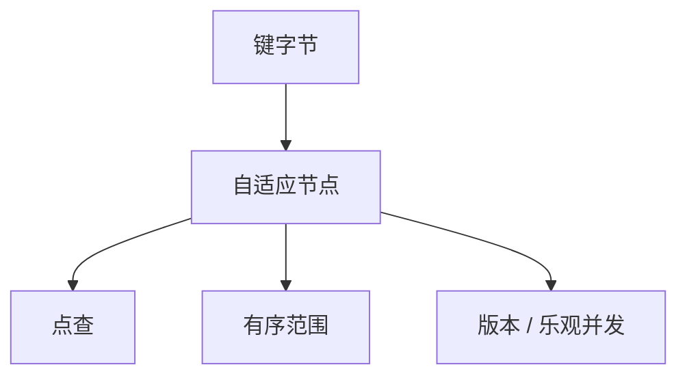

# ART 在数据库

自适应基数树按键字节下降，节点类型随扇出变；范围扫描保序，点查不先搅哈希。

<footer>—— 据 Leis, Kemper and Neumann, The Adaptive Radix Tree, ICDE 2013；计算机栏 ART 课接到引擎</footer>

[上一课](/cs/bw-tree)用 delta 链改逻辑 B 页。本课不 CAS 映射表。缺口是另一主存有序索引：计算机课已讲 [ART 结构](/cs/art-adaptive-radix)（Node4/16/48/256、前缀压缩）。数据库进阶把它接到缓冲、事务与范围扫描：二级索引、连接哈希的替代、或主存 OLTP 的主键树。

## 问题

B+ 面向页与磁盘；哈希索引无序。主存里 ART 用键的真实字节，扇出自适应，前缀压缩吃掉一元路径。缺口是**引擎合同**：并发（乐观锁、ROWEX）、值存在叶子还是 RID、与 MVCC 版本如何挂、检查点如何扫树。

范围：`WHERE k BETWEEN` 沿有序孩子走，比哈希友好。等值连接可用 ART 当内表索引 NLJ，或当构建侧的有序结构。本课不重推节点升级算法。

Leis, Kemper, Neumann, ICDE 2013。HyPer 等主存库使用。整数键大端化以保序。本课不抄实验表。

## 方法

主键：键→行指针或行内嵌。二级：键→RID 列表。并发：读乐观验证版本计数，写锁节点或用 ROWEX 读写锁变体。崩溃：ART 在易失内存则靠日志重放重建，或定期序列化；与 Bw 的映射表落盘问题同类。

与缓冲池：纯主存 ART 不经页帧；混合存储把冷键落 B+，热键 ART，是工程分层，本课点名。

## 机制

缓存行：Node16 可用 SIMD 比较，这是 CPU 课与数据库执行的交界，不是另一查询语言。延迟物化：叶子可只存 RID。学习索引后课用模型代替树下降；ART 仍是精确结构，最坏路径有界。

锁：不要把 ART 节点 latch 与行锁混淆，pin-latch 课的分层仍成立——若 ART 不在页里，则节点锁替代页 latch。

## 边界

本课不讲 LSM 的 memtable 用 ART 还是跳表——LSM 下一课。也不把 ART 当磁盘主键的默认。字符串极长前缀的内存要压，极端时退化。

后课默认：主存有序点查与范围可用 ART。LSM 与 compaction：写优化路径把随机写变成顺序文件，索引形状又变。

ART 保键序；哈希 memtable 不保，范围扫描要另结构。

## 小结

- 数据库里 ART 作主存有序索引，结构见计算机课，合同是并发与持久。
- 范围扫描是相对哈希的理由。
- LSM 与 compaction 下一课：写放大换顺序写。
- 出处：Leis, Kemper, Neumann, ICDE 2013；ART 结构课。
