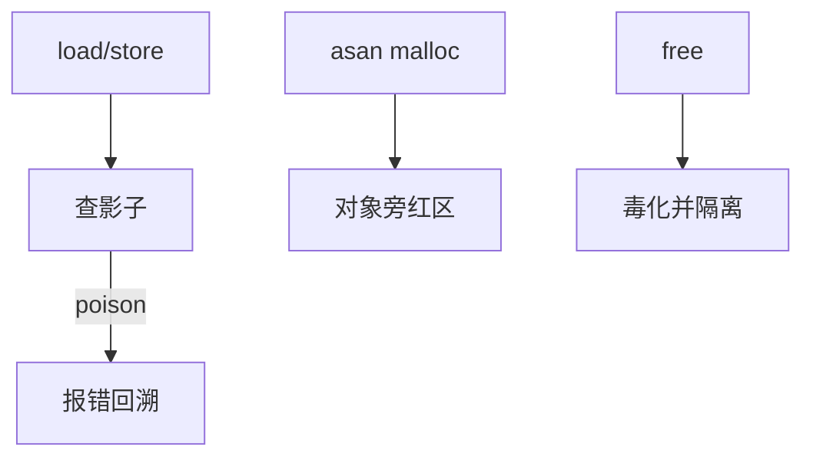

# ASan 的机制

AddressSanitizer 在每个对象周围插红区，并用影子内存记录每个字节是否可访问；编译器在每次访问前插入检查。

<footer>—— 据 Serebryany et al., AddressSanitizer, USENIX ATC 2012；LLVM/GCC 对 ASan 的文档</footer>

[上一课](/cs/arena-allocators)留下的缺口接到本课。 [MTE](/cs/memory-tagging) 是硬件粗粒度。[malloc](/cs/malloc-implementation) 自己的 debug 钩不完整。缺口是 **ASan**：软件插桩 + 影子，如何接到 OS 的 mmap。内存课序在此收口。

## 问题

越界读可能不立刻崩。ASan：分配多拿红区，影子（常 1/8 内存）编码 poisoned。访问：把地址映射到影子，非零则报。缺口：栈、堆、全局各有插法；use-after-free 把释放块毒化并延迟真 reuse；与 [fork](/cs/fork)、信号、[vfork] 的坑。本课不把 UBSan 的全部检查列出。

KASAN 是内核同构。硬件 ASan（MTE）可减少影子。生产一般不开完整 ASan，税是内存与指令。

## 方法

链接 asan runtime：替换 malloc，mmap 影子。编译 `-fsanitize=address`。对照 memcg：ASan 进程 RSS 暴涨是影子，不是泄漏。对照 [userfaultfd](/cs/userfaultfd)：都拦截访问，一个检测非法，一个合法填页。对照 KPTI：无关用户插桩。

## 机制

ASan 把空间错误变成确定崩溃，是开发期的 OS 外衣：依赖 mmap 大区域、替换分配器、信号处理。它不证明无 bug。不要写成形式验证课。与竞技场：ASan 分配器通常不用生产 tcmalloc 的同一套 bin。

假阴性：未插桩的汇编、DMA、内核。假阳性少，但内联汇编会漏。

实现上：影子通常占虚址的 1/8，64 位机器靠大空洞映射。拦截 memcpy 才能抓住块内越界。halt_on_error 与 abort 决定测试能不能继续。 读法上只引用[上一课](/cs/arena-allocators)的结论，不把对象换成训练推理或限价簿。

本课在操作系统进阶的「内存进阶 / 回收、迁移与加固」课序里，对象是 **ASan 的机制**。

- 先修只引用，不重导：上一课的结论当公理，本课只补差。
- 五栏不吞并：不把本课写成大模型训练/推理，也不写成限价簿或权重量化。
- 文献用 OSTEP、McKusick、内核文档与具名会议论文；不发明 arXiv 编号。

## 边界

本课不引入 HWASAN 的历史实现细节。不保证嵌入式没有足够虚址放影子。调度进阶第一课：CFS 之后的 EEVDF。

版本字段会变，课序钉的是机制对象「ASan 的机制」，不是某一主线内核的结构体名。
后课默认：软件可用影子红区查越界。公平调度从 vruntime 走到 EEVDF，下一课。

## 小结

- ASan：红区 + 影子 + 编译器检查。
- 依赖用户 mmap 与替换 malloc；税高。
- EEVDF 调度是下一单元。
- 出处：Serebryany et al., ATC 2012；LLVM ASan；KASAN。
