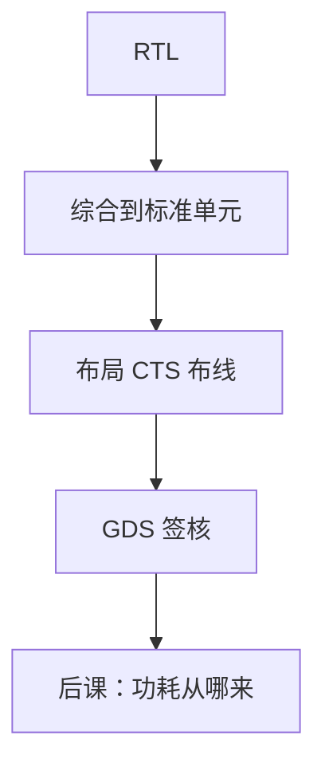

# ASIC 流程与标准单元

  
标准单元是预先刻画的门与触发器版图；数字 ASIC 把网表摆到行里再布金属，不再用 LUT 真值表实现布尔函数。

  <footer>—— 据 Weste and Harris, CMOS VLSI Design；Harris and Harris, Digital Design and Computer Architecture；Rabaey, Chandrakasan, Nikolic, Digital Integrated Circuits 整理</footer>

[上一课](/cs/hls)仍落到 RTL。[FPGA LUT](/cs/fpga-lut-clb) 是可配置砖。量产数字芯片走另一条：**标准单元 ASIC**——库里每只 NAND、DFF 有延迟、功耗、版图。缺口是流程角色：综合→DFT→布局→CTS→布线→签核，与 FPGA 开关盒对照。

## 问题

标准单元行（row）等高，电源轨在行边。布局把 FF 与门放进行，合法化间距。布线在金属层上按设计规则连线，没有预制开关盒，灵活性高、一次性工程费用（NRE）高。缺口不是再讲 LUT 映射，而是：**库**是时序/功耗/噪声模型的来源，STA 用 .lib，版图用 LEF/GDS。

存储编译器生成 SRAM 宏，对应 FIFO RAM 与 cache，不从标准单元一比特一比特搭（除非很小）。

### 标准单元不是「比 FPGA 更快的同一架构」

同一 RTL 在 ASIC 上通常更快更省电，因为硬连线与可定制时钟树、电压。但架构（流水线深度、FMA 宽度）仍是设计者的，工艺不自动给出华莱士树。把 ASIC 理解成 FPGA 的超频模式，微结构决策会被跳过。

Weste/Harris 与 Rabaey 等 DIC 是 VLSI 教材。Harris DDCA 对比 FPGA/ASIC。本课不进入光刻分辨率、双重图形——那是光刻栏；这里只到「要交给代工厂一套 GDS」。

## 方法

前端：RTL、综合、[STA](/cs/sta)、形式与仿真。DFT 插入扫描。后端：floorplan、宏放置、标准单元放置、[CTS](/cs/clock-skew-cts)、布线、RC 提取、再 STA、物理验证（DRC/LVS）。功耗分析用切换活动。签核角：P-V-T 多角。

FPGA 比特流可反复下载；ASIC 掩膜一次，验证权重更高——后课验证与 DFT 因此紧挨着功耗之后补全。

## 机制

功耗墙、时钟门控、老化都作用在这套版图上。软错误针对 SRAM 与 FF。本课先钉「网表有物理身体」。代工 PDK 提供单元与规则；设计者不到晶体管级手画每一个与门。

## 边界

本课不讲模拟全定制运放，不写 FinFET 工艺步骤，不把 EUV 光刻机当数字流程的一环。不讨论晶圆经济学细节——摩尔课会从成本侧再进。

后课默认：数字 ASIC 映射到标准单元行与金属布线；延迟来自 .lib 与提取，不是 LUT 与开关盒。

## 小结

- 标准单元是预先刻画的门/FF；ASIC 摆行布金属。
- 流程：综合与 DFT 之后物理闭合到 GDS。
- 与 FPGA 同 RTL、不同砖与 NRE。
- 出处：Weste and Harris；Rabaey et al.；Harris and Harris。
