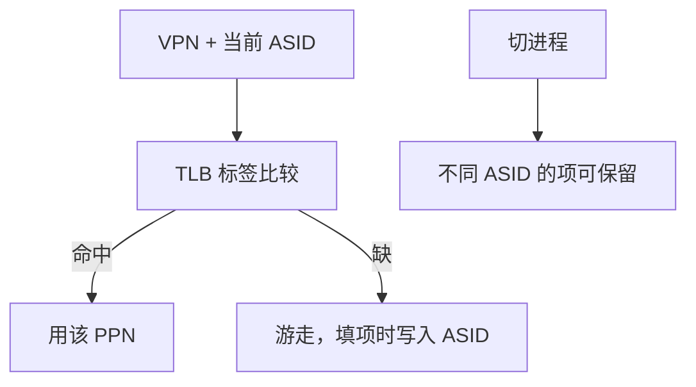

# ASID / PCID

TLB 条目带上地址空间编号，切进程不必把所有翻译丢掉；编号用尽或内核改了页表，仍要按地址作废。

<footer>—— 据 Hennessy and Patterson, Computer Architecture: A Quantitative Approach 整理</footer>

[上一课](/cs/hw-page-walk)让 MMU 自己走表填 TLB。[TLB](/cs/tlb-translate) 已点名「切换要刷或用 ASID」，未把标签写成机制。本课不重讲游走状态机。缺口是：TLB 存的是 VPN→PPN，而各进程的 VPN 重叠；不带空间标识就会把别人的翻译用在当前 `satp` 上。本课只钉 ASID/PCID：查找时标签匹配须含空间号。

## 问题

进程切换改根页表指针。若 TLB 仍热着旧进程的 VPN，下一条用户 load 会命中错误 PPN，保护被绕过。最简办法：切换时全部无效。工作集翻译全变成强制缺失，IPC 掉一截。缺口不是更大的 TLB，而是**每条 TLB 项存 ASID（ARM/RISC-V）或 PCID（x86），查找用「当前空间号 + VPN」**。

内核全局映射（对所有进程同 PPN 的窗口）可用全局位，切换仍保留那些项。本课承认这一位，不把具体 CSR 编号当正文。

ASID 位宽有限。操作系统维护 PID→ASID 的分配，用尽则回收并作废该号下的项。

## 方法

当前 ASID 写在翻译控制寄存器里，与根指针一起切换。TLB 命中条件：有效、VPN 匹配、ASID 匹配（或全局）。硬件游走填项时写入当时的 ASID。内核改某一进程页表：对该 ASID 做地址范围无效，而不是全芯片全刷。

PCID 与 ASID 同一思想：x86 在 CR3 里带 PCID，INVPCID 按编号作废。本课不绑指令助记符。

## 机制

切换的 TLB 强制缺失从「整本工作集」变成「冷 ASID 或容量不够」。这是局部性在翻译缓存上的版本：进程来回切时，两边的热页翻译可以同时住在 TLB 里，只要编号不同。

安全：忘记改 ASID 或全局位标错，会串空间。作废必须覆盖「该项可能被旧表填过」的集合。与 cache 包含性无关：TLB 不是数据层次的一层，但内核改页表后两边都可能要动——数据 cache 用物理标签则不必因切进程而全刷数据 cache。

## 边界

本课不引入虚拟机的 vPID/VMID 二层标签，不讨论 TLB 射击的核间 IPI。一致性问题下一课针对的是数据副本，不是翻译标签；但 DMA 与多核会让「当前值在哪」变成主缺口。也不把 ASID 当成用户可编程的沙箱：用户改不了自己的 ASID。

后课默认：切进程保留带编号的 TLB 项；改页表则按 ASID 作废。同一物理行的多份 cache 副本如何一致，是下一课。

## 小结

- TLB 查找 = VPN + ASID/PCID（或全局位）。
- 切换不必全刷；编号回收与改表仍要定向作废。
- 数据副本的一致性是下一课，不是翻译标签。
- 出处：Hennessy and Patterson, *CA:AQA* TLB 与进程切换。
