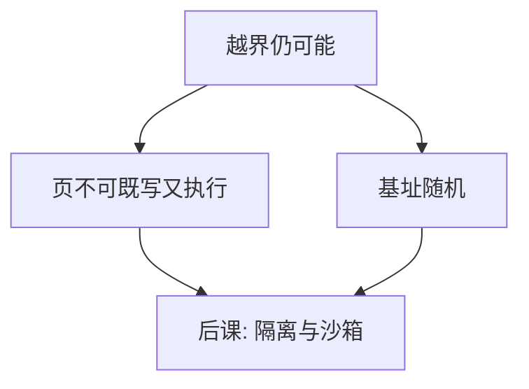

# ASLR 与 NX

NX 让数据页不能当指令取；ASLR 让对象不再落在每次启动都相同的地址。二者提高利用代价，不证明程序没有越界。

<footer>—— 据硬件 NX 位与操作系统地址空间随机化的工程实践；对照[地址空间布局](/cs/addrspace-layout)</footer>

[上一课](/cs/buffer-overflow)说明越界可改控制数据。本课不描述如何构造那种写入。缺口是：历史上栈既可写又可执行，布局又固定，使「改返回地址」与「在缓冲里放指令」叠在一起。NX（W^X）把页的写与执行分开；ASLR 把[地址空间布局](/cs/addrspace-layout)的基址每次搅乱。

## 问题

若页可写又可执行，控制流一旦被改，就可以把数据当代码取指。若映像、库、栈、堆的基址固定，控制数据里的指针可以预先知道。缺口不是攻击配方，而是硬件与内核提供的**页权限与随机化**：执行位、写位互斥；mmap 与栈顶加随机偏移。

ASLR 的熵受位数与对齐限制；信息泄漏（把地址打到日志或响应里）会把它打回「几乎固定」。NX 不拦只改已有代码指针的那一类完整性破坏。

## 方法

页表把区域标为可读/可写/可执行的组合，W^X 拒绝写执行同页（JIT 要显式切换，是受控例外）。ASLR：加载器为 PIE 可执行文件、共享库、堆、栈、vdso 选随机基址。内核与用户态都可以随机化；KASLR 是内核侧对照。本课不讨论绕过策略。

## 机制

NX 把「数据变代码」这条路关掉，迫使完整性破坏去复用已有可执行字节——课程只需要知道代价变了，不需要知道怎么复用。ASLR 让硬编码地址失效，除非敌手先得到地址。两者与最小特权正交：它们不缩小权限集，只改变地址空间的可预测性与可执行性。

W^X 的例外（JIT）必须短暂且显式，否则 NX 名存实亡。

## 边界

不要把 ASLR/NX 写成「溢出已解决」。内存安全与隔离才缩小问题本身。也不要在本课写绕过清单。JIT、内核模块、可执行栈的遗留兼容是工程例外，必须极窄。

栈金丝雀检测返回地址被改，属于编译器插入的完整性检查，与 NX 互补：一个发现，一个阻止数据当代码。后课默认：单进程内的布局防御不够时，把不可信代码关进更小的权限域——沙箱与隔离。

两者都是概率与权限位上的减益，不是形式证明。与最小特权一起，才构成纵深，而不是互相替代。

## 小结
- 地址泄漏会把 ASLR 的熵吃掉；NX 不处理已有代码指针被改写。
- 后课沙箱把不可信代码的权限集再切一刀。

- 越界是根因；NX 分写与执行，ASLR 随机化基址。
- 泄漏与已有代码指针使二者都不完备。
- 把损坏关在更小权限域里，是隔离与沙箱课。
- 出处：硬件 NX / DEP 机制；操作系统 ASLR；Anderson 对纵深防御的讨论。
