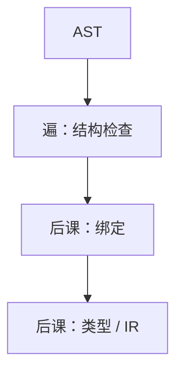

# 访问者与遍

树的形状固定，操作随遍增加：把遍历做成访问者，类型检查、解释、IR 生成各写一组 visit，而不改节点类。

<footer>—— 据 Gamma et al., Design Patterns, 1994；Appel, Modern Compiler Implementation 整理</footer>

上一课[抽象语法树](/cs/ast)交出压缩后的有序树，并声明后课要遍历。本课不重定义 BinOp。缺口是**遍**（pass）怎么挂在树上：递归函数按节点种类分支，或访问者把「对每种节点做什么」从树节点里拆出去。[编译器通行证](/cs/compiler-passes)已有管道；本课把管道的前端段落实为 AST 上的多次行走。符号表还没有，visit 遇到 `id` 仍只看见字符串。

## 问题

若每个新分析都改节点类加方法，节点会膨胀成上帝对象。访问者：`visit(BinOp)`、`visit(If)`…，双分派或手工 `switch` 种类。一遍可以综合属性（自底向上求值），一遍可以继承属性（自顶向下传作用域）。语法制导定义里的综合/继承与此对应，本课用遍历实现，不把属性文法公理写完。

遍的次序：先解析绑定，再类型，再 IR。错序会在未绑定的名字上查类型。本课只钉「多遍、每遍一种职责」，查找规则下一课。

### 访问者不是图算法 DFS 的别名

AST 是树，一般无共享（公共子表达式前）。遍历是树递归，不是 CFG 上的数据流。不要把后课活跃变量的迭代当成 visit 一遍就结束。

GoF Visitor。Appel 的每章一棵树加一组 visit。龙书用语法制导，动作写在产生式上，与归约时构造 AST 是同一遍历的不同时机。本课允许分析期再走树，不必全在归约瞬间做完。

## 方法

定义节点代数数据类型。写 `Visitor`：默认递归孩子，再覆盖要做事的种类。遍与遍之间可把结果写回节点字段（类型、绑定指针）或另建并行结构。错误继续遍历以便多报。

[树](/cs/tree-as-acyclic) 的无环保证递归终止。若语言允许图（已有命名类型的环），visit 要备「正在走」标记，那是类型课的名义类型，本课点名。

## 机制

前端管道 = 词法、语法、若干 AST 遍。中端换成 CFG 就不再用本课的树访问者，而用块上的迭代。本课不开始填符号表，但 visit 进入 `Block` 时将是 push 作用域的位置——下一课接。

不要为了访问者模式把简单编译器写成框架地狱；函数式语言里一组函数定义即访问者。

## 边界

本课不解析名字、不检查类型、不生成三地址。不把解释器当必选遍。后课默认：会对 AST 走遍。作用域与符号表层叠是下一缺口。

## 小结

- 遍 = 对 AST 的一次职责单一的遍历；访问者把操作从节点拆出。
- 综合自底向上，继承自顶向下。
- 绑定尚未发生；下一课符号表。
- 出处：Gamma et al., 1994；Appel, *Modern Compiler Implementation*。
