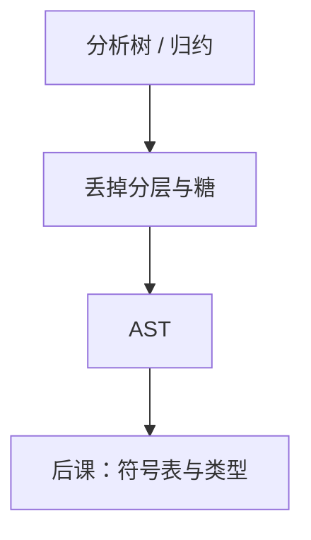

# 抽象语法树

分析树忠实于产生式；抽象语法树只保留后课语义与翻译需要的运算节点。

<footer>—— 据龙书第 5 章；Appel, Modern Compiler Implementation 整理</footer>

上一课[SLR 与 LALR](/cs/slr-lalr)在归约时已经能挂动作。本课不重造项集。缺口是：推导树含大量「只为文法分层」的节点（$E\to T$、$T\to F$）。后课类型检查与 IR 不需要它们。抽象语法树（AST）是压缩后的有序树：运算符、字面量、声明、语句列表。

## 问题

分析树的叶是记号，内节点是产生式。优先级分层会让 `1+2` 变成一长串单子节点。缺口是定义另一棵树：节点种类按语言概念（BinOp、If、Assign），孩子是子表达式，不再记得用了哪条 $E\to E+T$。二义已在文法或冲突消解里去掉，AST 假定唯一。

[树作为无环连通图](/cs/tree-as-acyclic)给出树；本课指定节点载荷。不要把 AST 当 DAG：公共子表达式消除才把树收成 DAG，那是 IR 课以后。

### 抽象不是「不精确」

丢掉的是语法糖与分层非终结符，不是类型信息——类型还没有。括号不进树：结合性已由结构表达。源位置（行号）应保留，为报错，那是装饰，不是抽象掉的对象。

龙书用语法制导定义把动作写在产生式上，直接 new 节点。Appel 强调 IR 前的 AST 是前端产品。本课不写访问者模式的全部样板。

## 方法

归约 $A\to\alpha$ 时，用 $\alpha$ 各符号已有的子树构造 $A$ 的 AST 节点。递归下降则每个 `parseA` 返回节点指针。关键字、分号通常不建节点。

列表结构（语句序列、参数表）用向量，不必强迫二叉。

## 机制

后课遍历 AST：作用域进入块节点、类型在表达式节点上综合。IR 生成是另一遍遍历。树形保持源程序的嵌套，便于报错；线性 IR 才方便数据流。本课不开始填类型。

宏展开若发生在词法/预处理，AST 可能看不见宏调用。那是语言设计，点名即可。

## 边界

本课不做类型检查、不建符号表、不生成三地址。不把 AST 序列化格式写成标准。具体语言的节点清单不穷尽。后课默认：语义分析的输入是 AST。名字如何对应声明是下一课作用域。

## 小结

- AST 保留运算与语句结构，丢掉纯文法节点。
- 在归约或下降时构造；源位置留下报错。
- 还不是类型、不是 IR。
- 出处：Aho et al., 龙书第 5 章；Appel, *Modern Compiler Implementation*。
