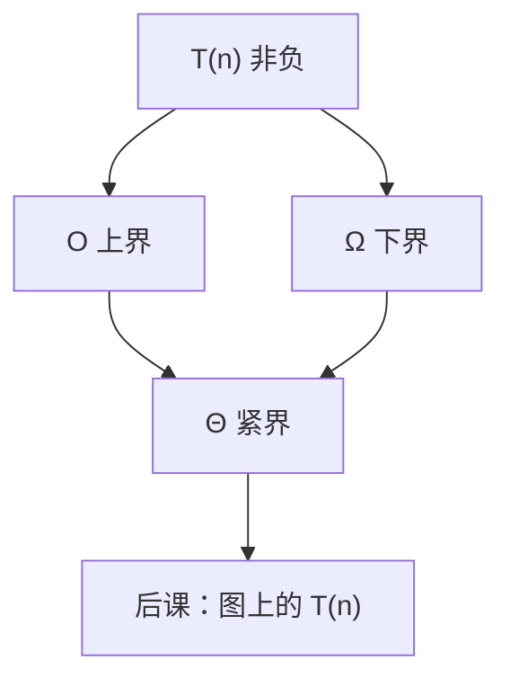

# 渐近记号

只关心 $n$ 足够大以后增长速度的上界、下界和紧界，常数与低次项都收进记号里。

<footer>—— 据 Cormen, Leiserson, Rivest and Stein, Introduction to Algorithms, 第 3 章 整理</footer>

上一课[容斥](/cs/inclusion-exclusion)钉死了如何对每个 $n$ 证明 $P(n)$。本课不重写基础步，也不从「算法是什么」另起。缺口是：归纳可以证明循环做对了，还没有语言说「做完要多久」。后课图算法、排序，必须比较增长，而不是比较某台机器上的秒数。

## 问题

两段程序都对，一段嵌套循环，一段分治。常数因子依赖实现，本栏不把计时当定义。缺口因此不是新的证明格式，而是 CLRS 第 3 章那套：$O$ 是渐近上界，$\Omega$ 是下界，$\Theta$ 是同阶，$o$ 与 $\omega$ 是非紧的。定义用存在常数 $c$、$n_0$，使 $n\ge n_0$ 后不等式成立。

本课只钉记号与常见多项式、对数、指数的比较。主定理、分治递归式是很后面算法课的叶子，这里不预支。

### $O$ 不是「最坏情况」

$O$ 是函数之间的关系，可以说某算法最坏运行时间是 $O(n^2)$，但 $O$ 本身不管输入分布。把「平均 $O$」与「最坏 $O$」混成一个词，后课快排会说不清。也不把 $O(n^2)$ 当成「恰好平方」：那是 $\Theta$。

CLRS 强调记号描述的是函数，不是算法。本课的 $T(n)$ 先当作给定的非负函数；如何从代码读出 $T$，后课循环与递归再做。

## 方法

$f(n)=O(g(n))$ 当存在 $c>0$、$n_0$，使 $n\ge n_0$ 时 $0\le f(n)\le c\,g(n)$。$\Theta$ 则上下同时夹住。多项式：最高次项决定 $\Theta$。$\log n$ 增长慢于任何正幂；$2^n$ 快于任何多项式。证明用极限或归纳不等式，不在本课把 Stirling 全写开。

## 机制

有了记号，后课才能写「邻接表上 BFS 是 $\Theta(V+E)$」而不绑定时钟频率。机器字长、比特操作的常数，在 RAM 模型里常被收进 $O$ 的 $c$。本栏组成课稍后会把周期数与门延迟写具体；与本课不冲突：一个是渐近，一个是纳秒。

多变量代价（图的 $V,E$）把 $n$ 换成几个参数，记号仍适用，须声明对哪些量取极限。

## 边界

本课不引入摊还、期望运行时间的形式化——后者要等[离散概率](/cs/discrete-probability)之后，快排那课才用。也不把 NP 的多项式时间定义提前。小 $n$ 时常数可以压过渐近，工程选择不由本课独断。

后课默认：比较算法代价用 $\Theta$、$O$、$\Omega$；说「平方级」默认 $\Theta(n^2)$ 除非另注。

## 小结

- $O$、$\Omega$、$\Theta$ 比较增长，藏起常数与低次项。
- $O$ 不是最坏/平均的同义词；$\Theta$ 才是同阶。
- 对数、多项式、指数的阶已经够后课排序与图。
- 出处：CLRS 第 3 章。
