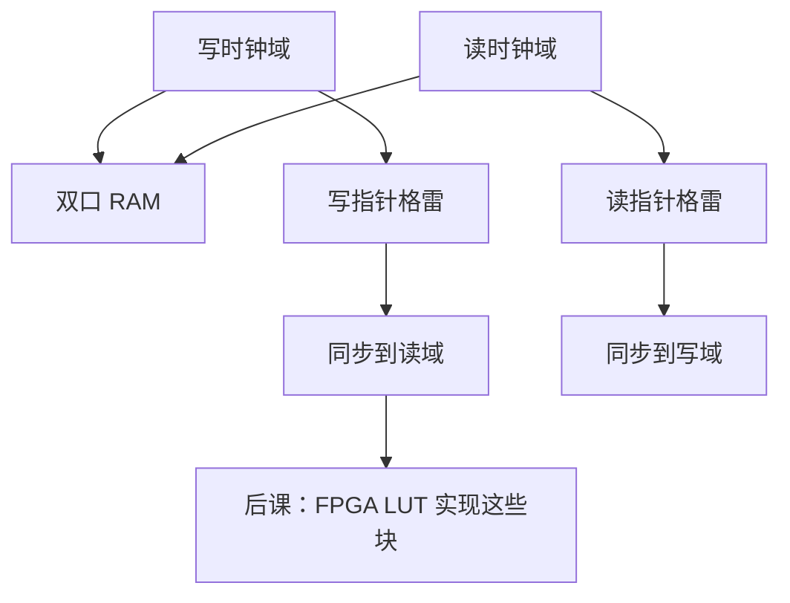

# 跨时钟域 FIFO

  
两个无关时钟之间不能直接采样多比特总线；用格雷码指针的异步 FIFO，让空满比较只过同步器，数据停在 RAM 里。

  <footer>—— 据 Cummings, Simulation and Synthesis Techniques for Asynchronous FIFO Design, SNUG 2002；Harris and Harris, Digital Design and Computer Architecture 整理</footer>

[上一课](/cs/reset-strategy)要求每域各自同步复位。组成课的[时钟域](/cs/clock-domain)已禁止直接跨域打多比特。[复位](/cs/reset-strategy)只解决控制初值。缺口是**数据**：生产者时钟写、消费者时钟读，如何不丢、不重复、不亚稳。

## 问题

单比特过两级同步器。总线的各位亚稳窗口不同，会采到从未出现过的组合值。异步 FIFO：双端口 RAM，写指针在写时钟域递增，读指针在读时钟域递增。把指针编成[格雷码](/cs/gray-code)再同步到对域，空/满在对域比较。缺口不是再定义亚稳，而是这套指针协议。

深度与几乎满/几乎空阈值是实现参数。本课钉格雷指针 + 同步，不把每家 IP 的参数表抄来。

### FIFO 不是「加几个 FF 打一拍」

打一拍只在**同一时钟**下是流水线。跨域打一拍仍是非法多比特采样。把 CDC 理解成「插入寄存器就能过 STA」，STA 若把跨域当同步路径还会误报/漏报。应用 `set_clock_groups -asynchronous` 一类约束，功能正确靠 FIFO 结构。

Cummings SNUG 2002 异步 FIFO 是经典参考。Gray 码保证相邻指针只变 1 比特，同步后要么旧值要么新值，不会跳成第三种计数。

## 方法

写域：二进制写指针转格雷，写入指针寄存器，同步到读域。读域对称。满：同步过来的读指针与本地写指针比较（需多 1 位区分满空）。RAM 地址用二进制指针。复位：两域都回到空，且[同步释放](/cs/reset-strategy)之后才能开始比指针。

握手（valid/ready 加同步器）适合稀疏控制；突发数据用 FIFO 更合适。

## 机制

后课 FPGA 有专用异步 FIFO 原语；ASIC 用库 RAM + 本课指针。形式验证可用断言：不满则写、不空则读、数据序保持。那是验证课的用例。DFT 扫描不要把跨域伪路径当成扫描移位违例——约束再次必须匹配。

## 边界

本课不解决相位已知的同源分频（可用同步 FIFO 或使能）。不讲 SerDes 弹性缓冲的全部 PCS。不把网络 socket 缓冲当成 CDC。

后课默认：无关时钟之间的多比特数据走过格雷指针异步 FIFO；单比特才直接两级同步。

## 小结

- 跨域总线禁止直接采样；FIFO 把数据留在 RAM。
- 格雷指针只变 1 比特，可安全同步后比空满。
- STA 约束异步组；功能靠结构。
- 出处：Cummings, SNUG 2002；Harris and Harris；Gray 码先修。
