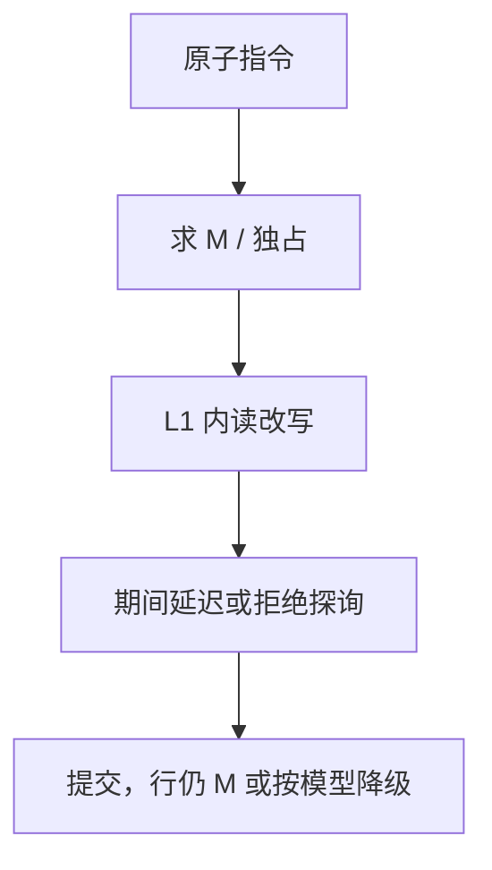

# 原子操作的缓存实现

CAS 与 fetch-and-add 在程序员看来是一条指令；在 cache 里它们是「拿到 M，在独占期间完成读改写，期间不让出该行」。

<footer>—— 据 Hennessy and Patterson, CA:AQA；McKenney 对 RMW 与缓存的论述 整理</footer>

[上一课](/cs/false-sharing) 说明行上的争用极贵。真共享时还需要原子：计数器、锁字、[LR/SC 与 CAS](/cs/lr-sc-cas) 在 ISA 对照里已经出现。本课不重讲伪共享填充。缺口是**微结构：原子 RMW 如何挂在 MESI/MOESI 上，以及锁住 cache 行期间发生什么。**

## 问题

普通 `add` 的 load 与 store 之间可以被他核的写插入。[LSQ](/cs/lsq-disambiguation) 只保证本核。原子要求中间态对外不可见。缺口不是再加一个目录态，而是**先升级到 M（或等价独占），在 L1 里完成 RMW，期间对该行的窥探延迟应答或重试。**

x86 `lock` 前缀历史上锁总线；当代是 cache lock：只锁该行。LR/SC：SC 时若行被作废则失败，不必全程占 M。

## 方法

执行原子：发出 Read-for-Ownership，等目录/窥探把 sharer 作废，行进 M。在 L1 对对齐地址做 ALU。提交前若被探询，要么延迟探询到 RMW 完成，要么放弃（SC 失败）。然后该行保持 M，或按协议共享。

## 机制

对齐：跨行原子要么禁止，要么锁两行——实现极痛，ISA 常要求自然对齐。争用：多个核打同一锁字 = 真共享 + 伪共享式颠簸，[分区](/cs/cache-partition-qos) 救不了。指数退避在软件；硬件只保证这一次 RMW 的原子性。

与 [退休](/cs/retire-precise-exception)：原子通常要在 ROB 头附近执行或至少提交时行仍独占，否则精确异常难定义。这降低 MLP：原子像一个小栅栏。

## 边界

本课不把所有 ISA 的原子清单写全。下一课 acquire/release 把「这一次 RMW」推广到「周围普通 load/store 能否重排」。事务内存则把多行原子合成一块，再下一课。

后课默认：原子 = 独占行上的 RMW。单地址原子还不够表达「解锁之前的写要对获取锁的人可见」——那是 acquire/release。

## 小结

- 原子 RMW 先拿 M，在 L1 完成，探询被推迟或 SC 失败。
- 跨行与高争用是性能悬崖。
- 把周围访存的顺序钉到释放/获取语义，是下一课。
- 出处：Hennessy and Patterson, *CA:AQA*；McKenney。
