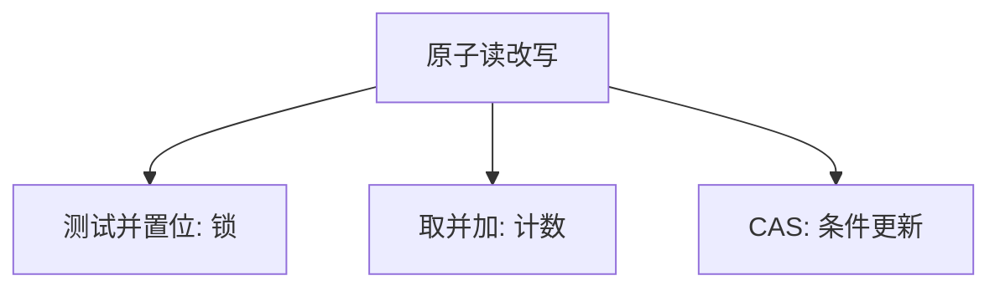

# 原子读改写

测试并置位、比较并交换、取并加，把「读—改—写」收成一条对总线可见的操作；没有它，锁字本身会竞争。

<footer>—— 据 Dijkstra 之后的硬件实践；Love, Linux Kernel Development 整理</footer>

[上一课](/cs/memory-barrier-os)钉住可见序，但锁字的「若为 0 则置 1」仍是两条访存，中间可被他核切开。[竞争](/cs/race-critical) 的计数器例子正是这种切开。缺口是硬件 **RMW 原子**：`swap`、`cmpxchg`、`fetch_add`，在缓存一致性协议下对该地址表现为不可分。本课只钉对象，不写微架构延迟表。

## 问题

纯软件 Peterson 在 SC 上可互斥，在放宽模型加编译器下脆弱。内核与用户运行时默认用原子指令做锁与引用计数。缺口不是再讲 fence 的分类，而是：**哪一类更新必须是 RMW**——锁字、引用计数、无锁链表的头指针。失败的 CAS 还给出无锁算法的循环，后课再收。

RMW 通常对同一 cache 行上锁（MESI 的 M），他核要等行转手。这就是自旋锁缓存行乒乓的来源。

## 方法

`test_and_set`：读旧值并置 1，返回旧值，用来做最简自旋。`fetch_add`：引用计数。`cmpxchg`：期望值匹配才写成新值，否则返回当前。内核把它们包成 `atomic_t` 与 `atomic_long`，并规定是否自带屏障。本课不把每种 ISA 的 `lock` 前缀写完。

单核关中断可以代替短 RMW，但挡不住多核；[锁与关中断](/cs/lock-irq) 下一课把两者搭配。

## 机制

原子性相对的是该地址上的其它访存，不是全内存全序——全序仍要屏障。CAS 的「成功」只说明这一刻值匹配，不说明指针所指对象没被回收，那是 ABA，更后一课。引用计数用 fetch_add 避免丢失更新，仍要配对的屏障才能与对象内容同步。

## 边界

本课不引入 LL/SC 的伪失败与循环重试的全部细节，只承认有的 ISA 用 LL/SC 模拟 CAS。也不把业务逻辑写成「一条 CAS 事务」。用户态关中断不能代替 RMW：那是特权。

后课默认：锁字用原子 RMW 更新。内核里还要决定是否关本地 IRQ，下一课[锁与关中断](/cs/lock-irq)。

## 小结

- RMW 让锁字与计数的读改写不可切。
- CAS/TAS/fetch_add 是三类常用形态；跨核仍碰 cache 行。
- 与 IRQ 的搭配是下一课。
- 出处：Love, *LKD*；Silberschatz et al., *OSC*。
