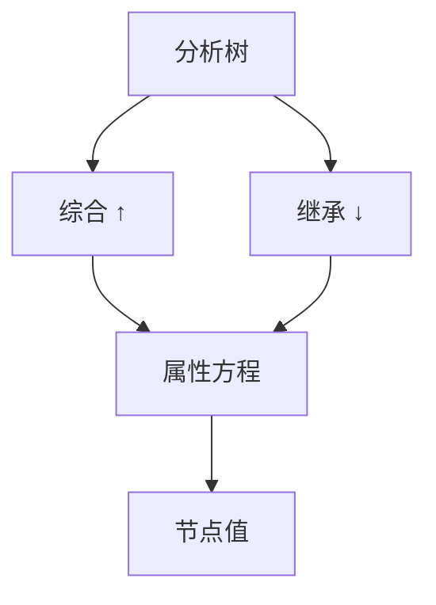

# 属性文法

产生式上挂综合与继承属性；依赖图无环则可求值。语法给树，属性给树上传值。

<footer>—— 据 Knuth, Semantics of Context-Free Languages, 1968；龙书第 5 章整理</footer>

上一课[增量解析](/cs/incremental-parsing)交出带区间的树。主干[抽象语法树](/cs/ast)与[访问者](/cs/ast-visitor)已能走遍。缺口是**声明式的节点值**：类型、作用域、代码地址不必全部写成手写遍的副作用。属性文法把「孩子综合出父、父继承给子」钉成规则。本课不把整个编译器改写成 AG 工具。

## 问题

访问者遍数一多，求值顺序隐在调用图里。Knuth：每个产生式一组属性方程。综合属性（S 属性）自底向上，正好可在 LR 归约时算——yacc 的 `$$=$1+$3` 就是。继承属性自上而下或从左兄到右弟，LL 更顺。缺口是**依赖与可求值性**，不是再定义 CFG。

循环依赖（类型与重载纠缠成环）使 AG 无法静态排程。实际编译器用手写遍或约束求解，AG 是说明书。

### 继承不是面向对象的 extends

这里的 inherited attribute 是「从树的上下文流进节点的值」，如外围作用域、期望类型。不要和类继承混名。

Knuth 1968。龙书第 5 章：S 属性、L 属性。本课不引入 AG 的全部子类谱系作业。

## 方法

为 `E → E + T` 写：`E.val = E1.val + T.val`（综合）。为声明列表写：`D2.env = D1.env ∪ {名字}`（继承给后续）。画依赖图，拓扑求值；或限制为 L 属性，保证一次左到右遍历足够。

与符号表：[作用域](/cs/scope-symtab) 可以是继承下来的环境指针，综合出的是绑定。后课语法制导翻译把方程写成生成 IR 的动作。

## 机制

S 属性 ⊂ L 属性 ⊂ 无环 AG。yacc 擅长 S 属性；要继承时人或用全局栈模拟环境，或换遍。增量：属性依赖跨脏区时要重求值，比纯树复用更脏——接上一课的边界。

不要用 AG 表达非上下文无关的全部 C++ 规则；可表达的是「树已定时的函数」。

## 边界

本课不写 Knuth 的全部算法复杂度证明。不把属性当运行时反射。后课默认：S 属性可在归约时求；更一般用多遍。下一课：语法制导翻译——把属性方程落成「生成三地址」的动作。

类型系统进阶课会把「值」换成判断过程，不是方程工具的失败。

## 小结

- 属性文法：产生式上的综合/继承方程。
- S 属性对齐 LR 动作；L 属性对齐一次左到右。
- 环状依赖就换约束或手写遍。
- 出处：Knuth, 1968；Aho et al., 龙书第 5 章。
