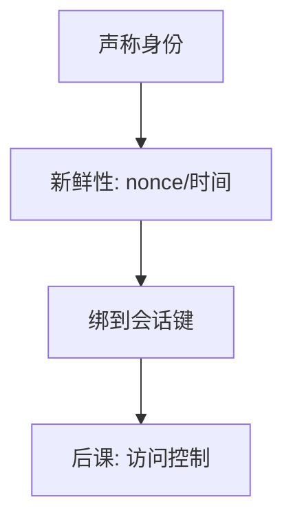

# 认证协议

认证是一次交互：证明此刻是谁，并抗重放；口令哈希只回答「核验对不对」，不回答消息能否被拿去再播。

<footer>—— 据 Needham and Schroeder；RFC 8446 对握手认证角色的整理</footer>

[上一课](/cs/kdf-slow-hash)规定口令怎么存。本课不重做盐。缺口是：核验发生在网上，敌手能重放、改序、降级。[TLS 入口](/cs/http-tls-entry)已经把传输层认证当作一种实例；这里抽出协议层共性：挑战–响应、绑定会话密钥、防止把认证当加密的误用。

## 问题

把口令每次明文送出，等于把秘密交给每一段路径。把固定 MAC 当「登录成功」票，会被重放。缺口不是新的哈希，而是**新鲜性**：nonce、时间窗、或把认证绑进密钥交换（如 TLS 1.3 的 Finished）。Needham–Schroeder 一类协议展示了：消息条数与加密对象一旦错，就会认证了中间人。

本课讲机制与失败模式，不给可抄的攻击步骤。对照：重放、反射、类型混淆是设计时要关掉的洞，用新鲜性与显式名字关。

## 方法

口令经已认证信道送出，或改用增强的口令认证密钥交换（只点名，不展开 PAKE 数学）。令牌：短期、绑受众、可撤销。多因素把「知道」与「持有」并列，本课只要求协议声明每一因素防哪一种敌手。会话建立后用对称键做后续 MAC，避免每请求再送口令。

## 机制

认证成功只推出「这次交互的对端拥有某秘密/私钥」。它不自动推出后续每个请求仍是同一对端——除非会话键把后续消息绑住。这与[套接字](/cs/socket-api)上「连接还在」不是一回事：套接字对端可以变，除非上层有绑定。证书认证与口令认证可以同时存在（双向 TLS + 用户登录），威胁模型要写清各保哪一层。

挑战必须不可预测；可预测 nonce 让重放窗口重新打开。时钟窗口是弱新鲜性，只能当辅助。

## 边界

不要把 OAuth 流程画成另一套密码学。单点登录是令牌分发，信任落在身份提供者。本课不写具体报文序列当可运行脚本。也不把认证与授权混名：下一课才问「已认证的主体能碰哪一个对象」。

会话固定（把已有会话绑到新登录）是协议层的完整性事故，要用新会话标识。后课默认：身份已经建立；缺的是最小特权下的访问规则。

降级（把双方劝回更弱的套件或更弱的核验）是协议敌手，要用版本绑死与拒绝过时方式来关，而不是靠「用户小心」。

## 小结
- 后课默认：身份已钉死，授权矩阵才有主体。
- 新鲜性关掉重放；显式名字关掉反射。本课不给可运行的报文抄本。
- 后课授权矩阵假定这次交互的主体已经钉死。

- 盐化核验是存储；本课补新鲜性与会话绑定，抗重放。
- 认证 ≠ 加密，≠ 套接字还活着。
- 能碰哪些资源，是 ACL 与最小特权的缺口。
- 出处：Needham and Schroeder, 1978；RFC 8446；Anderson。
