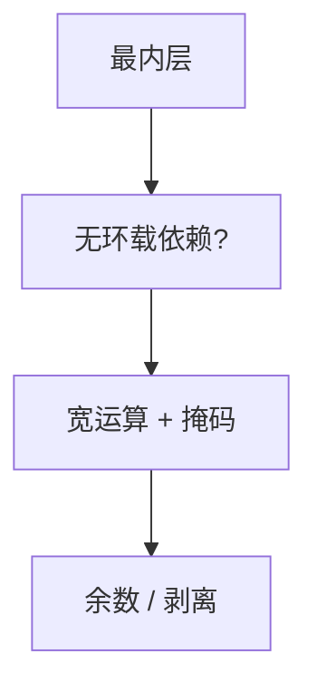

# 自动向量化

最内层循环若无环载依赖（或依赖距离足够），可把标量运算打成 SIMD。编译器要处理对齐、余数与控制流。

<footer>—— 据 Allen and Kennedy 向量化；Nuzman 等 GCC 自动向量化；龙书对 SIMD 的讨论整理</footer>

上一课[交换与分块](/cs/loop-interchange-tiling)把最内层摆到连续地址。缺口是**SIMD**：一次算向量宽 $W$ 个元素。本课钉依赖距离、对齐、掩码，不把 ISA 的全部 intrinsic 当目录。也不重写多面体。

## 问题

若迭代 $i$ 依赖 $i-1$ 的结果（递推），则不能直接向量化。归约（求和）可用向量归约再横加，次序改变——浮点要许可。控制流：`if` 变成掩码或分路。缺口是**把标量循环改写为向量 IR**，不是手写 intrinsic。

对齐：剥到对齐，余数标量或掩码尾。

### 向量化不是并行线程

SIMD 是单线程内的宽 ALU。OpenMP 多核是另一层。不要混。

Allen–Kennedy 经典向量机。Nuzman, Rosen, Zaks 等 GCC 自动向量化论文。LLVM LoopVectorize。本课不进 GPU SIMT 全模型。

## 方法

分析最内层：访存仿射、依赖距离。生成：向量 load/store、宽 ALU、收尾。SCEV（标量进化）提供 IV 闭式——与[归纳变量](/cs/strength-reduction-iv) 同一家族。

与展开：常先按 $W$ 展开再打包，或直接向量 IR。成本模型：是否值得（小行程则否）。

## 机制

别名：`restrict` 或运行时检查分出版本。间接访存（gather/scatter）有的 ISA 贵，可能放弃。不要向量化 `volatile`。

调试：向量体难对应源行，优化报告比静默失败重要。

## 边界

本课不写 SLP（基本块超字）全文，点名它是另一向量化。后课默认：可证明独立的最内层可 SIMD。下一课多面体：统一依赖与变换。

也不把权重量化（神经网络 int8）当本课；那是大模型栏。

## 小结

- 自动向量化：依赖允许则打 SIMD，处理对齐与余数。
- 归约与掩码改变次序或执行集，须语言许可。
- 成本模型决定是否做。
- 出处：Allen and Kennedy；Nuzman et al.；对照龙书。
