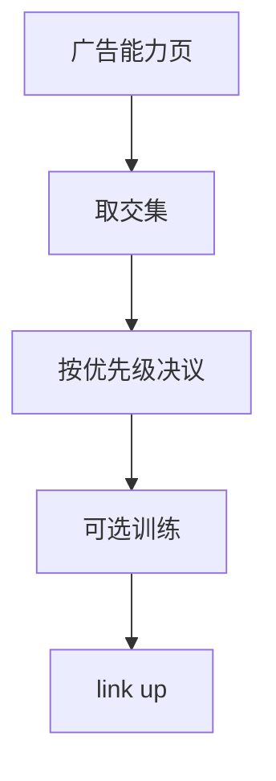
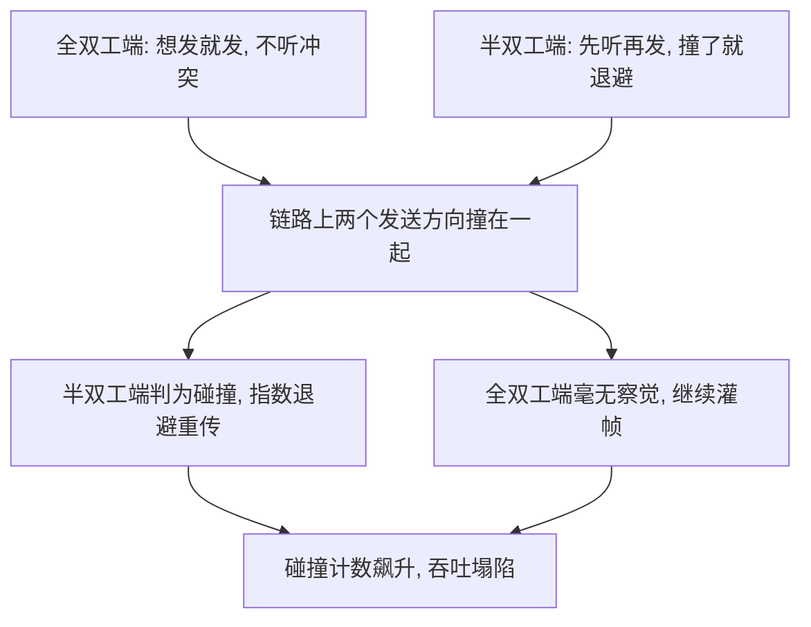

# 自协商与双工

链路两端先交换能力页，再选共同的最高模式；半双工与全双工一旦错配，吞吐会塌成冲突与延迟 ACK 的混合物。

<footer>—— 据 IEEE 802.3 Clause 28 / 73；RFC 4837 对双工不匹配的操作整理</footer>

[上一课](/cs/ethernet-speeds)列出速率档。两端可能一边强制 100M 半双工、一边自协商。缺口是**自协商**：用脉冲或协商页广告速度、双工、流控；决议选双方都支持的最高优先级。本课不把 PAUSE 帧格式写完。

## 问题

10/100 铜缆用 Fast Link Pulse 传能力。千兆及以上强制自协商（Clause 40/73），否则无法安全启用。决议失败或一边关协商，会出现单工错配：全双工端不听冲突，半双工端不断退避。症状像「网很慢」而不是口 down——比 PCS 丢锁更阴险。

主干[CSMA](/cs/csma-switch) 已说全双工交换链路不用 CD。本课钉的是：如何确认双方都进入全双工。

优先级通常是速度优先，同速则全双工优于半双工。802.3 表是规范；手工强制只在故障排查时用。

术语翻译：全双工是「打电话」，两边可以同时说、同时听；半双工是「对讲机」，一次只能一个人讲。半双工靠「先听再说、撞了就退避」的规矩活下去，一旦对面根本不守这套规矩，它就永远在给对方让路。

### 错配不一定 down

双工不一致常表现为「慢」而不是灭灯。千兆以上默认必须协商；一边强制一边 auto 是经典坑。流控能力位只表示可以暂停，不表示已经策略开启。

常见误区：一边设 auto、一边强制 100M 全双工，并不会「协商出」全双工——强制端不发能力页，auto 端探测不到协商方，往往自己回落成半双工，于是口 up、灯亮、却慢到怀疑断网。口诀：要么两边都 auto，要么两边强制成同一档。

## 方法

过程：并行检测遗留设备 → 交换页 → 选模式 → 训练（千兆以上）→ link up。画两端能力集合的交。错配对照：一端 CRS/碰撞计数飙升。管理上「双方都 auto」优于「一边 auto 一边强制」。

```mermaid
flowchart TD
  ADV["广告能力页"] --> INT["取交集"]
  INT --> PRI["按优先级决议"]
  PRI --> TRN["可选训练"]
  TRN --> UP["link up"]
```

## 机制

自协商在 PHY，不经过[生成树](/cs/spanning-tree) 的 BPDU。口 up 之后 STP 才开始。流控能力位会带到下一课 PAUSE/PFC：协商成功只表示「可以发暂停」，策略仍由交换机配置。

与 IP 无关：协商失败不会发 ICMP，只会让该口不成链路。

```mermaid
flowchart TD
  F["全双工端: 想发就发, 不听冲突"] --> L["链路上两个发送方向撞在一起"]
  H["半双工端: 先听再发, 撞了就退避"] --> L
  L --> X["半双工端判为碰撞, 指数退避重传"]
  L --> Y["全双工端毫无察觉, 继续灌帧"]
  X --> Z["碰撞计数飙升, 吞吐塌陷"]
  Y --> Z
```

数字实例：半双工端第 $n$ 次碰撞后在 $0$ 到 $2^{n}-1$ 个时隙里抽签等待，撞得越多等得越久；错配时它几乎每帧都「撞」，重传与退避吃掉绝大部分时间，实际吞吐可能只剩个位数百分比——而对端各计数器全绿，看起来一切正常。

## 边界

本课不引入 Backplane 协商的全部 FEC 能力位。PAUSE 与 PFC 是下一课。后课默认：双工与速率由自协商决议；错配表现为性能故障而非必然 down。

不要在汇聚核心关自协商「为了稳定」——当代光口另有协商，强制更容易错。

下一课[PAUSE 与 PFC](/cs/pause-pfc)。

## 小结

- 能力页取交，再按标准优先级选模式。
- 双工错配不总让口 down，但会毁掉吞吐。
- 千兆以上默认必须协商。
- 后课只引用本课钉死的对象，不从该领域总问题重开。
- 出处：IEEE 802.3 Clause 28/73；运维对照 RFC 4837。
