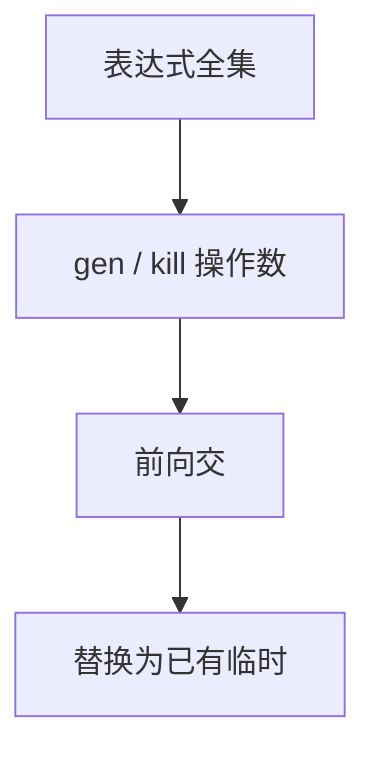

# 可用表达式

表达式 $x\,\mathrm{op}\,y$ 在 $p$ 可用，当从入口到 $p$ 的**每条**路都已算过它，且之后操作数没被改写。汇合是交。

<footer>—— 据龙书第 9 章整理</footer>

上一课[到达定义](/cs/reaching-def)是前向并，回答哪次写还活着。本课不重编号定值。缺口是公共子表达式消除（CSE）要的另一判断：这里能不能**重用**已经算过的 $t\leftarrow a+b$，而不必再算。必须所有路都算过，故交汇合；任一操作数被赋值则杀掉。后课指令选择在虚拟名 IR 上盖模板，可用集已尽量把重复运算收掉。

## 问题

`e` 在块内被计算则 `gen`；块内对 $a$ 或 $b$ 赋值则 `kill` 所有含该操作数的表达式。方程：`in[B]=\bigcap_{前驱} out[P]`（入口块 `in=\emptyset`），`out[B]=gen[B]\cup(in[B]-kill[B])`。从「全集合」或小心的初值迭代，交保证低估可用——少优化、不错。缺口是交与「表达式」对象，不是再写到达的并。

与活跃：活跃后向；可用前向交。三套（活跃、到达、可用）够用到分配前；框架同一，格与方向不同。

### 可用不是 DAG 里「看见过」

块内 DAG 只消块内重复。全局可用才能消跨块 CSE。不要把块内哈希当全局可用。

龙书 9.2.6 节。Appel 用可用做 CSE。代数恒等（$a+0$）是窥孔或另一格，本课只认字面同一 $a\,\mathrm{op}\,b$。

## 方法

枚举 IR 中出现过的表达式为全集的元素。算 gen/kill。交迭代。改写：若 $a+b$ 在指令前可用，换成对已有临时的拷贝，再交给拷贝传播。

关键边：若只在部分前驱可用，可在其他前驱补算再交——那是 PRE（部分冗余），本课点名不写完。

## 机制

kill 必须随赋值精确：`a` 被写掉则 $a+b$、$c+a$ 都死。别名保守：可能改到 $a$ 则杀，可用变少。SSA 上操作数是名，杀更干净。不要在浮点上随便 CSE 掉含舍入的重复，若语言允许收缩；本课整数 IR 默认可消。

与[到达](/cs/reaching-def)：到达告诉你 $a$ 来自哪次写；可用告诉你 $a+b$ 这个运算本身是否还在。二者常一起用。

## 边界

本课不选机器指令、不着色。不把循环不变外提写完（那要支配与回边，可用是零件）。后课默认：全局 CSE 按可用表达式做。指令选择把剩下的运算变成 ISA 模板。

## 小结

- 可用：前向、交；操作数被写则杀。
- 用于全局 CSE；块内 DAG 不够跨块。
- 低估可用才安全。
- 出处：Aho et al., 龙书第 9 章。
