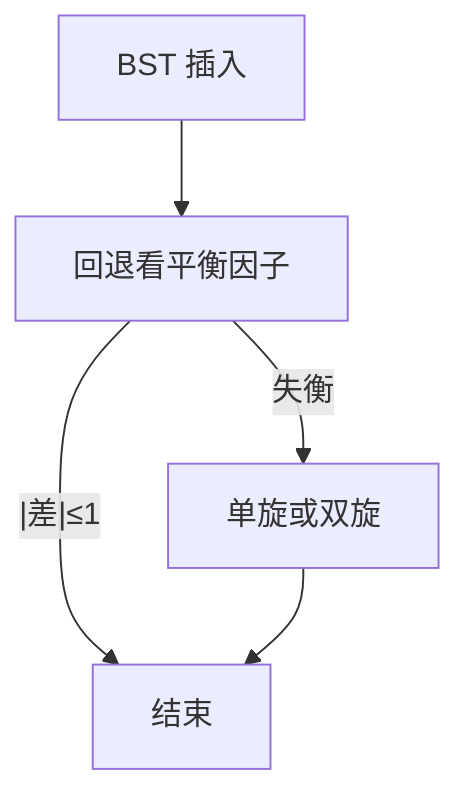

# AVL 与旋转

左右子树高度差不超过 1，插入后用一次或两次旋转恢复；高度就被钉在对数。

<footer>—— 据 Adelson-Velsky and Landis, An Algorithm for the Organization of Information, 1962 整理</footer>

[上一课](/cs/bst-delete)的查找是 $\Theta(h)$，并承认插入可以把树拉成链。[树作为无环连通图](/cs/tree-as-acyclic)的高度可以是 $n-1$。本课不重讲 BST 不变式。缺口是：插入删除之后仍要 BST，同时 $|h_L-h_R|\le 1$ 在每个节点成立。手段是旋转：改几根指针，中序序列不变。

## 问题

BST 合同若写成最坏 $\Theta(\log n)$，必须限制高度。完全二叉树有该高度，但插入不能每次重建。缺口不是换散列，而是**局部改指针的旋转**：左旋、右旋把子树「拧」一格，保持中序，改变高度差。

AVL 规定平衡因子在 $\{-1,0,1\}$。插入沿路径回退，遇到失衡则单旋或双旋。删除同样回退，可能连续旋转。本课把旋转钉清楚，不把所有删除情形画成百科。

旋转是树的结合律操作：$(AB)C$ 对 $A(BC)$，键序不变。后课红黑树用同一对旋转。

## 方法

右旋：节点 $y$ 的左孩子 $x$ 升为根，$x$ 的右子树接到 $y$ 的左。左旋对称。BST 不变式保持，因为 $x$ 与 $y$ 之间没有别的键。

插入失衡的四种形状：LL 右旋，RR 左旋，LR 先左后右，RL 先右后左。每次插入 $O(1)$ 次旋转，整次插入仍 $\Theta(\log n)$，因路径长 $O(\log n)$。

## 机制

AVL 高度 $h\le c\log n$，最坏查找/插入/删除都 $\Theta(\log n)$。比后课红黑更严，因而可能更多旋转，树更扁，查找略快、插入略慢——这是常数层，合同同为对数。

旋转改 $O(1)$ 条指针，不搬键。与数组插入的 $\Theta(n)$ 搬移对比，这是树作为字典表示的理由。

## 边界

本课不引入红黑的颜色约束，不把 AVL 写成唯一平衡方案。也不处理并发 AVL。父指针便于回退；用栈沿路径也可以。

后课默认：平衡 BST 存在，旋转是公共原语。红黑用更松的约束换插入时旋转次数的更稳上界。

## 小结

- AVL：每节点左右高度差 $\le 1$，高度 $\Theta(\log n)$。
- 旋转保持中序与 BST，用来恢复平衡。
- 红黑树用颜色代替严格高度差，下一课只给直觉。
- 出处：Adelson-Velsky and Landis, 1962；Cormen et al. 旋转作为预备。
