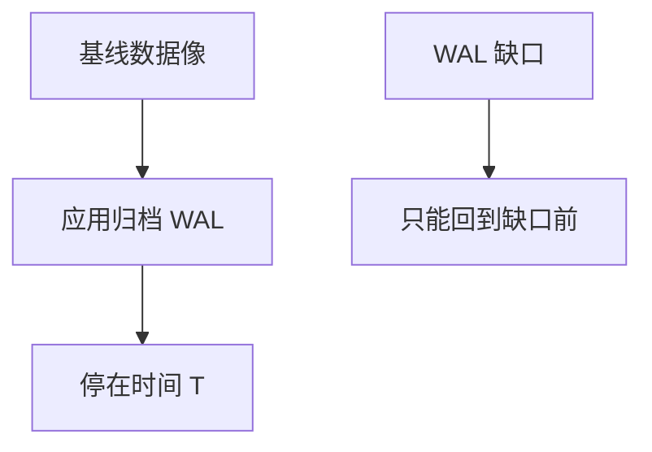

# 备份与 PITR

备份是过去某检查点的数据文件像；PITR 再把 WAL 前滚到指定时间。基线与日志链缺一不可。

<footer>—— 据 Gray and Reuter 备份；PostgreSQL PITR；物理备份实践</footer>

[上一课](/cs/rto-recovery)谈崩溃重启。本课谈**介质失败与误删除**：ARIES 救不了删掉的文件或逻辑错误（drop table）。备份+时间点恢复（PITR）用基线副本+连续 WAL 归档。逻辑复制下一课是另一条传送变化的路。

## 问题

物理备份：拷数据文件（常模糊一致+WAL 补齐）或快照。逻辑备份：dump SQL，慢、粒度表，可跨版本。PITR：从基线前滚 WAL 到时间 T 或某 LSN/事务。缺口是**归档完整性**：WAL 缺口则只能回到缺口前。误操作恢复要停在错误前，RPO 取决于归档粒度。

备份本身要测恢复，否则只是占用对象存储。与 TDE：备份密文，恢复要密钥。

Postgres `recovery_target_time`。热备份 vs 冷备份。本课不背某云快照 API。

## 方法

全量+增量（变化页）+ WAL。保留窗口：能 PITR 多远。校验：备份后 checksum、定期试恢复到临时实例。应用：恢复后可能要处理序列、复制槽、连接密码。

与组提交：归档的是已持久日志。异步提交未进归档的会丢，与 D 等级一致。

## 机制

模糊备份：拷文件时页在变，必须靠同时段 WAL redo 修到一致——与模糊检查点同构。快照若原子则少修。逻辑 dump 无 PITR 细粒度，除非再叠逻辑日志。

膨胀：未 vacuum 的堆会把死元组拷进备份，体积与恢复时间都差。

## 边界

本课不讲 CDC 解析。也不把备份当只读副本（延迟与用途不同）。Jepsen 后课测的是运行时一致，不是备份链。

后课默认：介质与误操作靠备份+PITR；崩溃靠 ARIES。逻辑复制与 CDC：把行变化流给下游，不是整库前滚。

没有演练的 PITR 目标时间是愿望。

## 小结

- 物理基线+WAL 链做 PITR；缺口打断链。
- 备份要试恢复；密文备份依赖密钥。
- 逻辑复制与 CDC 下一课。
- 出处：Gray and Reuter；PostgreSQL PITR。
