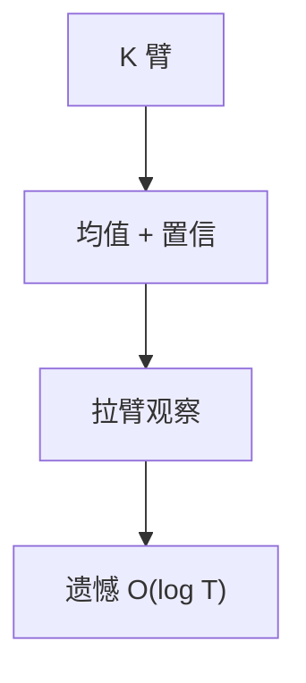

# 多臂老虎机与 UCB

探索未知臂与利用当前最好之间折中；UCB 用均值加 $\sqrt{(\log t)/n_i}$ 上置信界，遗憾 $O(\log T)$。

<footer>—— 据 Lai and Robbins, 1985；Auer, Cesa-Bianchi and Fischer, Finite-time Analysis of the Multiarmed Bandit, 2002 整理</footer>

上一课[秘书问题](/cs/secretary-problem)一次性选择。多臂：重复拉 $K$ 臂，$T$ 轮，奖励随机。缺口是遗憾（regret）与 UCB。不重写 $1/e$。本序列「不确定输入」在此结束。不写神经网络策略。下一序列近似算法。

## 问题

臂 $i$ 均值 $\mu_i$，$\mu^*=\max\mu_i$。遗憾 $R_T=T\mu^*-\sum$ 收益。贪心只利用会锁死次优。$\varepsilon$-贪心：以 $\varepsilon$ 探索。UCB1：$i$ 的指标 $\bar x_i+\sqrt{2\ln t/n_i}$，拉最大者。次优臂拉 $O(\log T)$ 次，遗憾 $O(\log T)$。

缺口是置信界探索，不是 MDP 全动态规划。

### 不是广告拍卖课

同一公式可出现在推荐，本课算法遗憾。不写限价。

Lai–Robbins 渐近下界。Auer 等 2002 UCB1 有限时间。后课顶点覆盖 2-近似换离线近似。

## 方法

每臂维护次数与和。每轮 UCB 选臂，观察奖励更新。$\varepsilon$ 可递减。下界：Lai–Robbins 对数遗憾必要（一定条件下）。

分布有界假设（Hoeffding）。

## 机制

欠拉的臂置信宽，指标大，被迫探索。拉够则置信缩，利用真最好。与秘书：秘书不能回头拉；bandit 可反复。与混合时间：这里 i.i.d. 奖励，不是图游走。

## 边界

本课不写对抗 bandit（Exp3）、不写上下文 bandit 全文。后课默认：随机 bandit 用 UCB，遗憾对数。下一课顶点覆盖 2-近似。

## 小结

- 遗憾权衡探索/利用。
- UCB 上置信界，$O(\log T)$。
- 贪心可锁死。
- 出处：Lai and Robbins, 1985；Auer, Cesa-Bianchi and Fischer, 2002。
