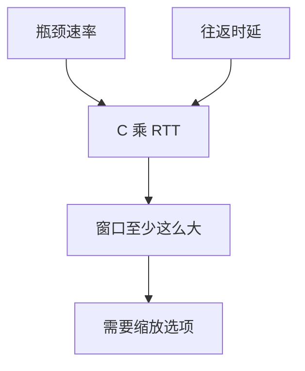

# 带宽时延积

管道里要装满 $C\times\mathrm{RTT}$ 的飞行字节才吃饱链路；窗口上限小于 BDP 时，AIMD 再公平也达不到 $C$。

<footer>—— 据 Kleinrock 管道直觉；Kurose and Ross 延迟带宽积；RFC 1072 / 7323 动机整理</footer>

[卫星](/cs/satellite-latency) 已点名 BDP。[上一课](/cs/fast-retransmit-recovery) 的快恢复要 FlightSize。[TCP 窗口](/cs/tcp-window) 的 16 比特字段未放大。缺口是**把 BDP 写成硬约束**：窗口、缓冲、初始窗口。本课不把窗口缩放选项写完，下一课写。

## 问题

速率 $C$、往返 $\mathrm{RTT}$，未确认字节需约 $C\times\mathrm{RTT}$。1 Gb/s × 100 ms = 12.5 MB，远超默认 64 KiB 窗口。数据中心 25 Gb × 10 μs 反而很小，incast 是瞬态不是 BDP。瓶颈缓冲：理论一 BDP 量级配合 MD，过小则锯齿碰空，过大则后课 bufferbloat。

不要把 BDP 写成「必须配置的内核参数名」，它是几何量。

Kleinrock 长肥管道。RFC 7323 为此扩大窗口。本课公式，选项下一课。

### 窗口几何量

飞行 ≥ $C\times$RTT 才吃饱。小 MSS 使填满更慢。缓冲与 BDP 同量级是经典折中，过深则膨胀。

## 方法

算两例：局域网 vs 跨洋 vs 卫星。对照 rwnd 与 cwnd：有效窗口 $\min$ 两者，再与 BDP 比。画管道：链路上的比特 = 带宽 × 单向延迟，往返则乘二（近似）。

方法止于选定对象与对照；机制才说它如何嵌入已有分层与主干课。

## 机制

AIMD 每 RTT 加一 MSS，填满 BDP 要约 BDP/MSS 个 RTT，长肥管道慢启动必须指数阶段帮一把。PMTUD 失败导致小 MSS，填满更慢。RoCE 用信用/PFC 填管道，不靠 cwnd 名，但几何相同。

测量：iperf 后课；这里只要承认窗口是 BDP 的操作化。

## 边界

本课不引入带宽估计滤波器。窗口缩放与时间戳是下一课。后课默认：吃饱链路 ⇔ 飞行 ≥ BDP（再加队列目标）。

应用自己再缓冲一层不增加 $C$，只加延迟。

上一课留下的缺口在本课收口；「带宽时延积」进入后课词汇表后只引用。文献用来钉对象与边界，不把本课写成该主题的独立综述。下一课[窗口缩放与时间戳](/cs/window-scale-timestamps)。

## 小结

- BDP $=C\times\mathrm{RTT}$ 是飞行字节目标。
- 小窗口或小 MSS 喂不饱长肥管道。
- 缓冲与 BDP 同量级是经典折中。
- 后课只引用本课钉死的对象，不从该领域总问题重开。
- 出处：Kurose and Ross；RFC 7323 动机。
