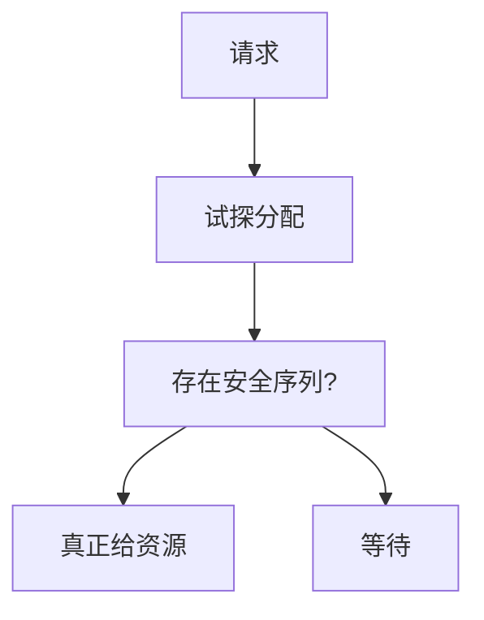

# 银行家算法

只在分配之后仍存在安全序列时才把资源给出去；否则让请求者等待。

<footer>—— 据 Dijkstra 对银行家算法的表述；Habermann, Prevention of System Deadlocks, CACM 1969 整理</footer>

[上一课](/cs/deadlock-prevent)用四条件刻画死锁，预防常靠锁排序或一次性申请，对「先声明最大需求、再分次要」的系统太死。缺口是**回避**：每次分配都检查「即使所有人随后按最坏顺序要满配额，仍能找到做完的次序」。这就是银行家算法。

## 问题

进程声明最大需求向量，当前占用 + 仍可再要 ≤ 声明。系统有剩余向量。一次请求若立刻满足，剩余减少；若存在一个序列，使每个进程能在「剩余足够其仍需」时跑完并归还，则状态安全。缺口不是再列 Coffman 条件，而是这个安全检查。不安全不是已经死锁，而是存在走向死锁的路径。

本课不把多资源类型的矩阵代码写成可编译程序，只钉判据。

Dijkstra 把银行家比作：放贷后仍能应付所有客户按额度提现的某种次序。Habermann 把它接到操作系统资源管理。

## 方法

对剩余 $A$、仍需矩阵 $Need$：反复找尚未完成且 $Need_i \le A$ 的进程，假想它跑完，$A$ 加上它当前占用。若所有进程都能这样被点到，安全。分配前对试探后的状态跑同一检查，失败则阻塞请求。

## 机制

回避比检测保守：拒绝进入不安全区，于是环不会形成。它要求**事先知道最大需求**，这在编译器已知的内核内部资源上偶尔成立，在用户随便 `malloc` 的世界里几乎不成立。因此通用 Unix 不以银行家为文件描述符的日常策略，教材用它说明「安全状态」与「死锁」不是同一集合。

与[调度](/cs/scheduling-metrics)的关系：被银行家挡住的线程是阻塞，CPU 可以给别人；它等的是资源安全，不是 I/O 完成。

## 边界

本课不声称 Linux 内核用银行家分配页框。不把死锁检测（跑时找环）与回避混成一步。最大需求若说谎，安全证明作废。也不处理资源种类动态增减。

多实例资源用矩阵；单实例时安全检查退化为避免图中出现环的预演，仍要配额。

后课默认：四条件之外还有「安全序列」这条回避路。操作系统作为课程要从同步回到**地址空间长什么样**——下一课布局，页表硬件仍用[分页](/cs/paging-vm)，不重导。

## 小结

- 安全 = 存在做完次序；银行家只进入安全状态。
- 不安全未必已死锁；需要事先配额。
- 通用 OS 很少对用户内存跑银行家；概念仍要。
- 出处：Dijkstra 银行家算法；Habermann, *CACM* 1969；Silberschatz et al., *OSC*。
