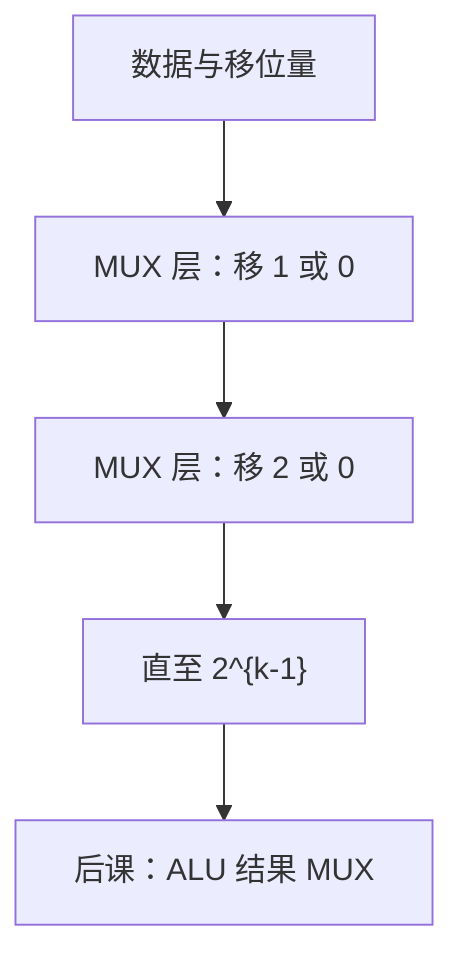

# 移位与桶形移位

移 $k$ 位可以串 $k$ 个一位移位器，也可以用对数级 MUX 一次选出；后者叫桶形，延迟按选择层数算。

<footer>—— 据 Harris and Harris, Digital Design and Computer Architecture；Patterson and Hennessy, Computer Organization and Design (RISC-V) 整理</footer>

上一课[阵列乘法](/cs/array-multiplier)用「左移再加」描述部分积，但移位本身还不是一块有名字的组合电路。本课不重铺部分积，也不从 RV32I 的 `sll` 编码另起。缺口是：**任意移位量**如何在一级组合里完成，供后课 ALU 接线。

## 问题

逻辑左移、逻辑右移、算术右移（复制符号）语义已在[补码](/cs/twos-complement)与乘法课出现。缺口是实现：一位移位器是接线加 MUX；要移 $0..n-1$，串行 $n$ 级则延迟 $\Theta(n)$。桶形移位器：第 $i$ 层按移位量的第 $i$ 位选择「移 $2^i$ 或 0」，深度 $\Theta(\log n)$，面积 $\Theta(n\log n)$ 个 MUX。

循环移位、漏斗移位点到为止。本课钉桶形作为 ALU 家族的第三块（加、逻辑、移）。

### 桶形不是「异步提前执行移位指令」

名字里的 barrel 指交叉开关/多层 MUX，仍是同一组合云。与[CLA](/cs/adder-cla)一样，不要理解成流水线超前。移位量来自指令立即数或寄存器低位，本课不译码 opcode。

Harris 画 log 级 MUX 树。Patterson/Hennessy 的 ALU 含移位。`srl`/`sra` 差在空位填 0 还是填符号，只改最高位那一路的数据源。

## 方法

数据 $n$ 位、量 $k=\lceil\log_2 n\rceil$ 位。层 $i$：MUX 选原值或右（左）移 $2^i$ 后的值，空位按逻辑/算术规则填。三态/传输门也可搭交叉阵，延迟模型仍按[关键路径](/cs/critical-path)。

## 机制

后课 ALU 把移位器输出送进结果 MUX，与加减、逻辑并列。关键路径可能被桶形或 CLA 主导，设计时要比，不能默认「移位免费」。多周期可用一位移位器加计数器，面积小、CPI 随 $k$ 涨——与乘法的两种实现同一权衡。

## 边界

本课不讲 SIMD 跨通道 shuffle、不把浮点对阶移位当同一块规范。旋转与漏斗是桶形的接线变体，不单开课。

后课默认：任意移位量可用 $\log n$ 级 MUX 组合完成；ALU 含这一口。

## 小结

- 一位串移延迟线性；桶形用对数级 MUX。
- 逻辑/算术右移只差空位填充。
- 仍是组合，计入 ALU 关键路径。
- 出处：Harris and Harris；Patterson and Hennessy, COD (RISC-V)。
