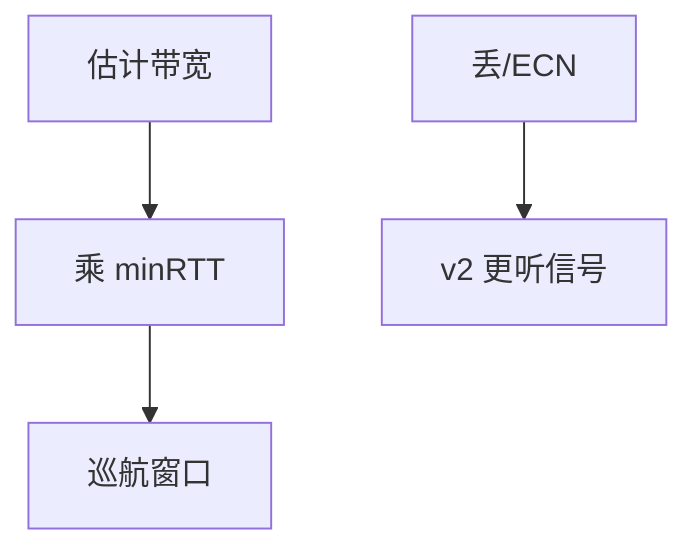

# BBRv2 / v3

BBR 用带宽与 RTT 估计管道，不靠丢包减半；v2/v3 修过估、公平与 ECN 反应，仍在模型与测量之间摇摆。

<footer>—— 据 Cardwell et al., BBR, ACM Queue 2016；BBRv2/v3 公开设计说明整理</footer>

主干[BBR 对照](/cs/bbr) 已给 v1 直觉。[缓冲膨胀](/cs/bufferbloat) 是 v1 在深缓冲上的痛。[上一课](/cs/quic-migration) 不改控制律。缺口是 **v2/v3 补什么**：带宽过估、与 CUBIC 共存、ECN。本课不把 Vegas 写完。

## 问题

v1 ProbeBw 可把队列推高，深缓冲上仍膨胀；对 CUBIC 不公平。v2：更保守的带宽头、对丢失/ECN 作出反应、量化公平。v3 继续调探测与启动。模型：maxBW × minRTT ≈ BDP，窗口绕此值。误码链路把丢当拥塞仍可能，但比 AIMD 少抽空——卫星动机还在。

不要把版本号写成已在 RFC 终稿冻结；课钉对象与问题。

v1：Cardwell 2016。后续版本以公开幻灯与代码为准，不把未冻结的草案号当标准。

### 模型不是 AIMD 换皮

v1 在深缓冲仍可膨胀。v2/v3 更听丢与 ECN，并修公平。版本以公开设计说明与代码为准，课钉对象不钉某年冻结稿。

## 方法

对照 AIMD 相位图 vs BBR 管道估计。画：Probe → Drain → Cruise。与 DCTCP：都利用 ECN，一个比例减，一个进模型。

方法止于选定对象与对照；机制才说它如何嵌入已有分层与主干课。

## 机制

QUIC 与 Linux TCP 都有实现。多路径下每条路径一套估计。AQM 浅队列让 minRTT 更真。P4 不实现 BBR，BBR 在端。RoCE 用 DCQCN 不是 BBR。

过估：把突发当可用带宽，会伤同队列邻居——v2 要压这点。

## 边界

本课不引入 PCC 等学习型 CC 全文。延迟型 Vegas/Swift 是下一课。后课默认：BBR 族是基于模型的 CC；v2/v3 针对公平与膨胀补丁。

与不可 ECN 的公网 CUBIC 混跑，结果仍依赖缓冲。

上一课留下的缺口在本课收口；「BBRv2 / v3」进入后课词汇表后只引用。文献用来钉对象与边界，不把本课写成该主题的独立综述。下一课[延迟型拥塞 Vegas / Swift](/cs/delay-based-cc)。

## 小结

- BBR 用 BW 与 RTT 估 BDP，而非纯 AIMD。
- v2/v3 加强对丢/ECN 与公平的反应。
- 深缓冲与误码仍是模型边界。
- 后课只引用本课钉死的对象，不从该领域总问题重开。
- 出处：Cardwell et al., 2016；BBRv2/v3 说明。
