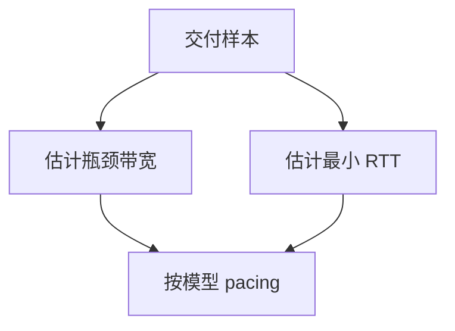

# BBR 对照

把速率对准估计的瓶颈带宽，把飞行数据对准最小 RTT 下的 BDP；拥塞信号从「队列溢出」转到「模型」。 

<footer>—— Cardwell, Cheng, Gunn, Jacobson and Yeganeh, BBR: Congestion-Based Congestion Control, ACM Queue 2016</footer>

[上一课](/cs/reno-cubic)在丢包驱动下比较了 Reno 与 Cubic。本课不重画立方曲线。缺口是：浅缓冲或无线误码时，丢包不等于瓶颈满；深缓冲时丢包来得太晚，队列已经很大。BBR 用交付率估带宽、用最小 RTT 估延迟，对照而非替换 TCP 可靠性。

## 问题

AIMD 把溢出当探针。缓冲很小则永远探溢；缓冲很大则延迟主导。BBR 的缺口是控制量改成两个估计：瓶颈带宽 BtlBw、往返传播 RTprop，发送速率与 `cwnd` 按 BDP 操作，并周期性探测是否变高/变低。本课不把版本号演进（BBR v2/v3）写成标准战争。

BBR 仍跑在 TCP（或 QUIC）上，序号与重传不变。它改变 pacing 与窗口，不改变 RFC 793 的字节流合同。

## 方法

探测带宽：以略超估计的速率发，看交付率是否上升。探测 RTT：短暂降速看最小 RTT 是否更小。稳态：pacing 接近 BtlBw，飞行数据略高于 BDP 以保持管道满。与 Cubic 对照：后者填缓冲直到丢；BBR 声称把队列压在小幅度。共存时可能不公平，这是对照的边界，不是本课调参。

## 机制

模型控制把「共享队列的博弈」从丢包博弈改成估计博弈。估计错（路径变化、聚合链路）会过冲或欠载。端到端正确性仍靠校验与重传；BBR 不提供新的 CIA 性质。后课 QUIC 可以换传输实现，仍可跑同类控制。

## 边界

本课不引入 XCP 一类路由器协助协议当主干，不把内核开关当教材命令。应用层名字如何映射到 IP，下一课 DNS。

后课默认：拥塞控制可以不把丢包当唯一信号。人可读的主机名是另一缺口。

## 小结

- BBR 用带宽与最小 RTT 建模，对照 Reno/Cubic 的丢包 AIMD。
- 可靠性合同不变。
- 名字解析下一课 DNS。
- 出处：Cardwell 等, *ACM Queue* 2016；对照 RFC 5681；Kurose and Ross。
