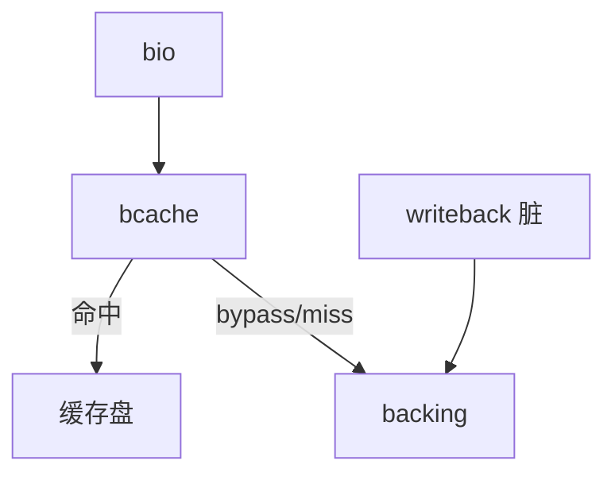

# bcache

bcache 用一块快设备做慢设备的块缓存：写回或写通，命中则不必再走 HDD 臂。

<footer>—— 据 Linux bcache 文档；Kent Overstreet 对 bcache 的设计讨论</footer>

[上一课](/cs/thin-provisioning)省的是容量。延迟仍可以是 HDD。[页缓存](/cs/page-cache) 是内存；重启丢失。缺口是 **块层持久缓存**：bcache（及后来的 bcachefs 不在本课）把 SSD 接到 HDD 前面。

## 问题

热数据若能停在 SSD，顺序冷数据留在大盘。bcache：backing + cache 设备，注册后出现 `/dev/bcacheN`。模式：writeback（写先进缓存，标脏）与 writethrough（写双份）。缺口：缓存未命中的绕过顺序流（顺序大写可绕过以免打满 SSD）；脏数据崩溃要用缓存超级块恢复；与 [dm](/cs/device-mapper-lvm) 的 dm-cache 是同类对象，课序以 bcache 为实例。

缓存集可服务多个 backing。丢 SSD 在 writeback 下等于丢脏数据，要用附件或接受损失。本课不把 bcachefs 文件系统写成同一课。

## 方法

读：查缓存桶（bucket）与 btree 索引，命中则从 SSD 填 bio，否则读 HDD 并可提升。写 writeback：写 SSD，完成上层，稍后回写 HDD。对照 FS 预读：预读仍发生在 bcache 之上或之下，取决于谁看到顺序。对照 RAID：缓存不是冗余。

## 机制

bcache 把「存储分层」放进块层，FS 无需知道。它与 CPU cache 同构只在「命中/缺失」口号上；一致性是脏桶与回写，不是 MESI。不要写成硬件预取课。与 [精简](/cs/thin-provisioning)：可叠，监控更乱。

错误：缓存只读降级、只通盘，是运维模式；课序要求理解脏数据依赖缓存盘。

实现上：writeback 模式丢缓存盘等于丢尚未回写的数据，要按电池或副本设计。顺序绕过阈值调错会让 SSD 被大备份打满，命中率崩。 读法上只引用[上一课](/cs/thin-provisioning)的结论，不把对象换成训练推理或限价簿。

本课在操作系统进阶的「存储栈 / 块层到设备」课序里，对象是 **bcache**。

- 先修只引用，不重导：上一课的结论当公理，本课只补差。
- 五栏不吞并：不把本课写成大模型训练/推理，也不写成限价簿或权重量化。
- 文献用 OSTEP、McKusick、内核文档与具名会议论文；不发明 arXiv 编号。

## 边界

本课不引入 EnhanceIO、Lvmcache 的参数对照表。不保证 NVMe 对 NVMe 再套 bcache 有益。下一课缓存都不经过：DAX 把持久内存直接映射进页表。

版本字段会变，课序钉的是机制对象「bcache」，不是某一主线内核的结构体名。
后课默认：块层可用 SSD 缓存 HDD。持久内存如何绕过块层进 CPU 缓存，下一课 DAX。

## 小结

- bcache 用快设备缓存慢设备；writeback 有脏。
- 顺序流可绕过以免污染缓存。
- DAX 与持久内存是下一课。
- 出处：Linux bcache；dm-cache 对照；*OSTEP* I/O 栈。
