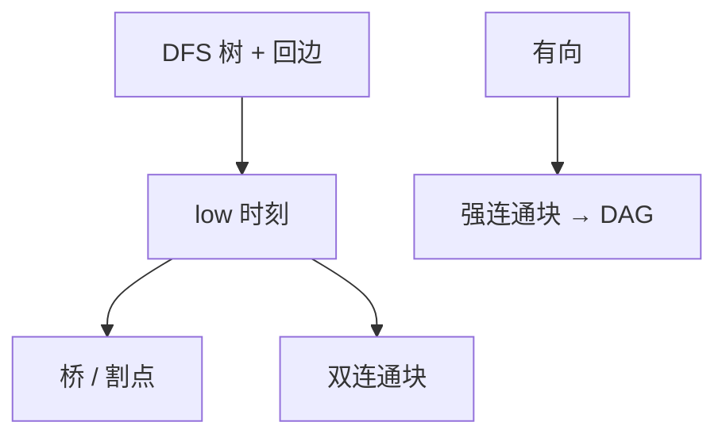

# 连通分量与桥

无向图上，删掉就使连通支数增加的边是桥；DFS 的 low 值在一次扫描里标出桥、割点与双连通块。

<footer>—— 据 Tarjan, Depth-First Search and Linear Graph Algorithms, 1972；CLRS 第 22 章整理</footer>

上一课[DFS 与边分类](/cs/dfs-edge-types)给出发现/完成时刻，以及有向环当且仅当反向边。无向图上非树边都连祖先，环的存在变成「有没有回边」，但**哪条边是桥、哪个点是割点**时刻不够用。本课不重做括号定理。缺口是 `low`：子树能摸到的最老祖先发现时刻。后课拓扑假定有向无环，本课先把无向连通的可切边收掉。

## 问题

边 $e$ 是桥：删 $e$ 后连通分量增多。点 $v$ 是割点：删 $v$ 后增多。双连通分量（BCC）：极大的、去掉任一点仍连通的边集块（实现上常按边划分）。缺口是线性算法，不是再 BFS 一遍看连通。

对树边 $(u,v)$（$u$ 父）：若 $v$ 的子树没有任何回边摸到 $u$ 或更老，则 $(u,v)$ 是桥。`low[v]=\min(d[v],` 回边端点的 $d$, 子树 `low)`。割点：根有不少于两棵子树；非根 $u$ 存在孩子 $v$ 使 `low[v]\ge d[u]`。

有向图的强连通分量是另一划分：相互可达。Tarjan / Kosaraju 同为 $\Theta(V+E)$。本课点名：有向环落在同一强连通块里；缩点之后才是 DAG。反向边判定环已经够用；SCC 是把环捏成点。

### low 不是距离

`low` 是发现时刻的最小可达，不是无权层数。[BFS](/cs/bfs-unweighted) 的距离不管桥。不要用「叶子边都是桥」代替：有回边的叶子边不是桥。

Tarjan 1972 一次 DFS 做双连通与强连通。CLRS 把桥与割点放在 22.2–22.5 的习题与应用。后课拓扑只消费「无向环已能找、有向环已能判」。

## 方法

无向图：DFS 记父，避免把树边当回边扫两遍。维护 `d` 与 `low`，回溯时更新父的 `low`，按不等式报告桥与割点。边栈可弹出一个 BCC。全图 $\Theta(V+E)$。

孤立点、重边：重边使「那一条」不是桥。实现要决定平行边是否拆。

## 机制

桥属于每一个过它的简单环的补：不在环上。BCC 之间恰在割点处粘连，像树。后课最短路、流都不假设双连通；本课只提供分解。也不要把连通分量（无向可达）与 BCC 混名：前者随便 BFS，后者要 `low`。

## 边界

本课不算最短路，不写 2-SAT 的蕴含图。有向桥（边连通）更细，不展开。后课默认：无向桥与割点可线性标出；有向环 $\Leftrightarrow$ 反向边，缩 SCC 得 DAG。拓扑排序是下一课把 DAG 变成线性序。

## 小结

- `low` 标出桥、割点与双连通块，仍 $\Theta(V+E)$。
- 有向强连通缩点后才谈拓扑。
- 有向环判定仍用反向边，本课不重证。
- 出处：Tarjan, 1972；CLRS 第 22 章。
