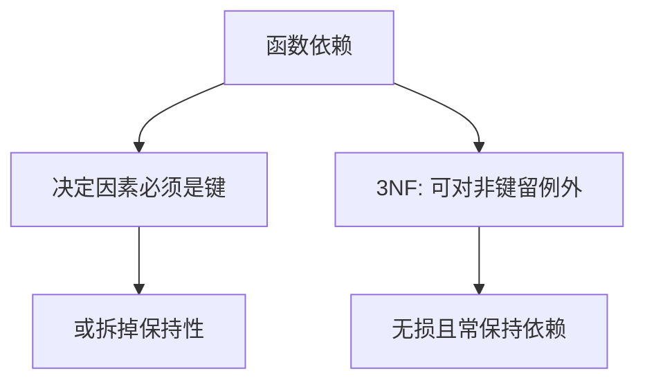

# BCNF 与 3NF 取舍

BCNF 要求每个决定因素都是候选键；3NF 允许对键的传递依赖以外的例外，以便有时保住依赖与无损。

<footer>—— 据 Codd 对 3NF；Boyce–Codd；Date；Bernstein 合成算法对照</footer>

[上一课](/cs/normal-forms)用函数依赖解释更新异常，并给出分解。本课不重定义 FD。缺口是两档范式的取舍：BCNF 更严，可能被迫拆掉「每个 FD 都能在某一张表里检查」；3NF 保证无损且保持依赖的合成存在，但允许少量冗余。视图下一课才把宽表变回来给用户看。

## 问题

范式课留下 3NF/BCNF 名字。BCNF：对关系 R 上成立的每个非平凡 X→Y，X 都是超键。反例：两个重叠候选键时，3NF 过、BCNF 不过。分解到 BCNF 总可无损，但不总保持依赖——应用必须连接后才能检查某条 FD。缺口是**选哪一档作为设计目标**。

保持依赖：每条 FD 在某一分解分量内可检查。3NF 合成算法对准这一目标。BCNF 追的是消除决定因素非键的冗余。

## 方法

列出候选键与 FD 闭包。能 BCNF 且保持依赖则取 BCNF。否则在「冗余」与「检查 FD 要连接」之间显式选择，而不是让应用偷偷存宽表。本课不把 4NF 多值依赖插进主干必做。

## 机制

取舍发生在模式层，查询仍用连接恢复。[谓词下推](/cs/predicate-pushdown) 不能代替分解：异常是写出来的，不是读计划慢。后课物化视图用空间换连接，那是另一份合同。

## 边界

本课不把「反规范化总是为了性能」写成默认建议；那要有代价数字与异常预算。用户还想看宽表时，下一课视图。

后课默认：设计时在 BCNF 与 3NF 间有意识选择。给用户的宽接口可以是视图。

## 小结

- BCNF 更严；3NF 更易保持依赖。
- 分解无损与保持依赖不可总同时在 BCNF 拿到。
- 视图与物化下一课。
- 出处：Codd；Boyce–Codd；Date。
