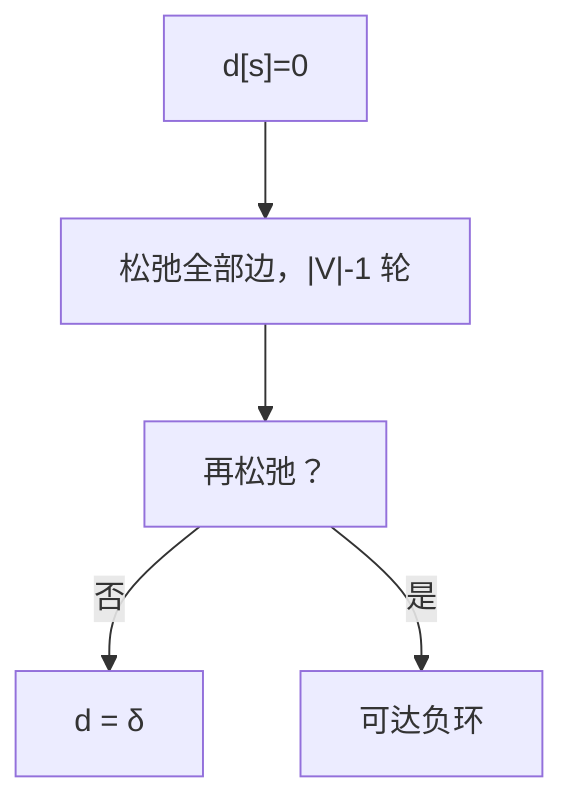

# Bellman–Ford

允许负边时，反复把每条边松弛 $|V|-1$ 遍；还能再松弛，就有从源可达的负环。

<footer>—— 据 Bellman, On a Routing Problem, 1958；Ford, 1956；CLRS 第 24 章整理</footer>

上一课[Dial 与堆变体](/cs/dijkstra-heap)在非负权上钉死 Extract-Min。本课不重证那条不变式。缺口是：**边权可为负**，但不能让「越走越短」的负环把最短路定义毁掉。本课交出 $|V|-1$ 轮全边松弛，以及第 $|V|$ 轮检测。

## 问题

最短路若存在，简单路径最多 $|V|-1$ 条边。对每条边松弛一轮，至多把「边数 $\le k$ 的最短路」推进到 $k+1$。故 $|V|-1$ 轮后，若无负环可达，则 $d[v]=\delta(s,v)$。再松弛成功则存在从 $s$ 可达的负环，最短路无下界。

Dijkstra 的 $S$ 在负边下会过早钉死。本课不用优先队列，每轮扫全部边。代价 $O(VE)$。仍在 P；不引入 NP。

### 负环不是「有负边」

负边可以出现在 DAG 或正环图上，最短路仍在。只有**环上权和为负**且从源可达才使 $\delta=-\infty$。不可达的负环不妨碍源点树。检测只对还能松弛的点及其前驱链负责。

Bellman 1958 与 Ford 的标号法是同一松弛。CLRS 24.1 把第 $n$ 轮当检测。路由里的距离向量是后话；本课只在静态图上。

## 方法

初始化同 Dijkstra。重复 $|V|-1$ 次：对 $E$ 中每条边松弛。再扫一遍，若仍更新则报负环。前驱链可回溯环，本课不写找环的细节。

[邻接表](/cs/adj-list-matrix)每轮扫 $E$。稀疏图仍是 $O(VE)$，没有 Dijkstra 那种堆加速——负权禁止那个贪心。

## 机制

$k$ 轮后不变式：若 $\delta(s,v)$ 有限且某最短路 $\le k$ 条边，则 $d[v]$ 已正确。负环打断「简单最短路」的存在。差分约束系统可化成本课：边权为不等式，负环即不可行，本课点名不展开。

与拓扑：DAG 上按拓扑一轮松弛即可，不必 $|V|-1$ 轮。有环才需要本课的重复。

## 边界

本课不做全源（可对每个源跑，或下一课 Floyd）。不处理费用流。浮点误差可把「近零负环」判错，实现用整数权。也不把「SPFA 队列优化」当最坏保证：最坏仍可 $VE$ 量级。

后课默认：负边单源 = Bellman–Ford，$O(VE)$，可检测可达负环。全源下一课用三维 DP。

## 小结

- $|V|-1$ 轮全边松弛给出无负环时的单源最短路。
- 第 $|V|$ 轮还能松弛 $\Leftrightarrow$ 可达负环。
- 代价 $O(VE)$；不能用 Dijkstra 的取出。
- 出处：Bellman, 1958；CLRS 第 24.1 节。
