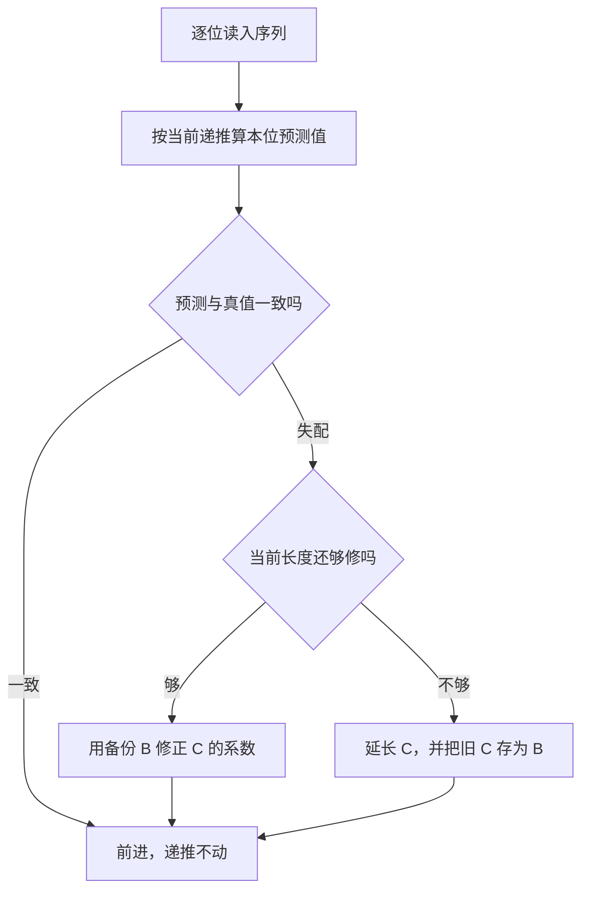
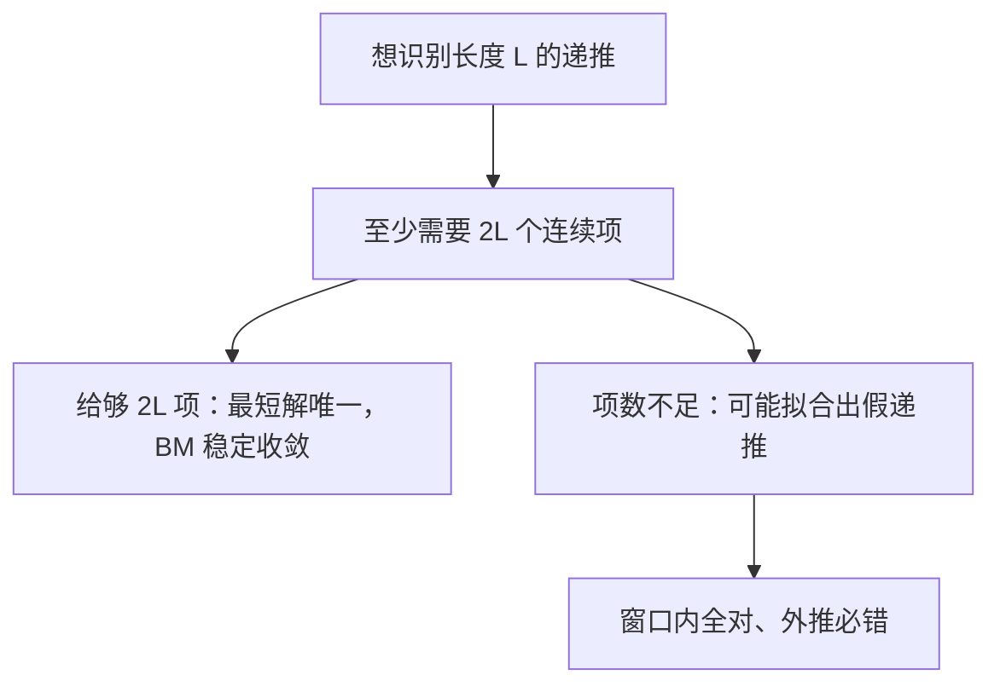

# Berlekamp–Massey 递推识别

给一段观测序列，最短的能生成它的线性递推是什么——Berlekamp–Massey 一遍扫描给出答案，答案的长度本身就是这条序列的线性复杂度。

<footer>—— J. L. Massey, Shift-Register Synthesis and BCH Decoding, 1969</footer>

[上一课](/cs/euler-tour-tree)伺候的树再怎么动，结构始终摆在明面；这一课反过来——只给序列，不给结构，问「哪条最短线性递推能生成它」。暴力算出前几十项、想外推到第 $10^{18}$ 项，第一步就是把「猜递推」变成「算递推」。本课写 BM 算法，不写 BCH 译码的完整上下文。

## 问题

竞赛与工程里的高频桥段：某个量跑程序能算出前 $40$ 项，答案却要第 $10^{18}$ 项。人眼找规律不可靠，枚举递推长度逐个解方程是 $O(k^3)$ 的土办法。缺口：从序列到递推式的系统算法，还要能说清「找到的就是最短的」。本课不写：非线性规律的识别（多半无解）、BM 在编码译码中的完整流程。

数字实例：斐波那契 $0,1,1,2,3,5,8$ 的递推是 $a_i=a_{i-1}+a_{i-2}$。BM 扫到第 $3$ 项失配、把长度从 $1$ 提到 $2$，此后一路零失配——$8$ 个数够它锁定长度 $2$。

术语翻译：LFSR，线性反馈移位寄存器；BM 找的递推式与 LFSR 的反馈系数一一对应，「最短递推」即「最短能生成该序列的寄存器」，长度称线性复杂度。

## 方法

维护当前递推 $C(x)$、上次失配时的备份 $B(x)$ 与失配位置。逐位扫描：第 $i$ 位算失配值——按当前递推预测该位，与真值作差。零失配就前进；非零失配时看长度够不够修：够，用 $B$ 修正 $C$ 的系数；不够，延长 $C$，并把修正前的 $C$ 存进 $B$。

一遍扫描 $O(k^2)$，$k$ 取几十到几千都在毫秒级。实现难点全在「备份时机」：存晚了，$B$ 里是修过的系数，修正公式当场作废。

直觉类比：像配一把最短的万能钥匙——齿太短开不动（递推短了压不住序列），太长白费料（塞满 $k-1$ 个系数谁都能拟合有限项）。BM 的价值在于每一步都知道「最短」到底还没到。

## 机制

短，为什么可求：识别长度 $L$ 的递推等价于解一组 Toeplitz 型线性方程，$2L$ 个连续项唯一确定最短解；BM 不显式解方程，而是增量维护解、对上次失配做秩一修正，把复杂度从立方压到平方。线性复杂度就等于输出递推的长度，这条性质让它反过来当「规律是否线性」的体检器：递推长度随喂入项数稳定不再涨，才敢往下信。

常见误区：把 BM 的输出当唯一真理。有限长序列永远存在无数条更长的递推与它相容；错在把「窗口内成立」当成「全局成立」。验证只有一条路：再多喂几项，失配就说明还没到头。

## 边界

只对线性规律有效——几何数列、矩阵幂特征值的组合、卷积结果的尾段全是线性递推，BM 都接得住；快速幂套取模复合这类非线性行为，BM 给出的只是数值巧合，别外推。域要挑对：模数为素数才谈得上除法与失配修正。BM 与下一课是上下游：BM 给出递推式，下一课的多项式取模负责拿这条式子算第 $k$ 项——一个管「规律是什么」，一个管「第 $10^{18}$ 项是多少」。

常见误区：只有 $3$ 个观测项就敢拿长度 $2$ 的递推外推——识别它至少要 $4$ 项，$3\lt 2L$，窗口锁不死规律，错在跳过了「项数至少两倍递推长」这条门槛。

## 小结

- BM 一遍 $O(k^2)$ 扫描输出最短线性递推，长度即线性复杂度。
- $2L$ 项连续观测是识别长度 $L$ 递推的门槛，短窗必出假解。
- 输出是「相容的最短解」，不是被证实的规律；加项验证不可省。
- 递推式到手后交给下一课的多项式取模去算远项。
- 出处：J. L. Massey, *Shift-Register Synthesis and BCH Decoding*, IEEE Trans. Inf. Theory, 1969；E. R. Berlekamp, *Algebraic Coding Theory*, 1968。
