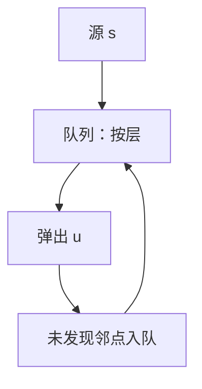

# BFS 与无权最短路

队列按发现次序弹出顶点；在边权为 $1$ 的图上，这就是最短路。

<footer>—— 据 Moore, The Shortest Path Through a Maze, 1959；CLRS 第 22 章整理</footer>

上一课[中位数的中位数](/cs/median-of-medians)收束了数组上的比较算法。图的定义、[邻接表](/cs/adj-list-matrix)、[队列](/cs/queue-buffer)都已在数据结构课。[渐近记号](/cs/asymptotic-notation)够用。本课不重画图。缺口是：表示还不是算法——无权（或边权全 $1$）时，源点到各点的最短路怎么算。本课只交出 BFS 与层。

## 问题

从 $s$ 出发，要 $d(s,v)$：最少边数。若每次把新发现的邻点丢进栈，得到的是深度优先的某条路，不是最短。缺口是**宽度**：先处理离 $s$ 边数为 $i$ 的全体，再处理 $i+1$。队列保证弹出次序非降于发现距离。

循环不变式：队列里是当前层与下一层的 frontier；已出队顶点的 $d$ 已是最短。灰/白/黑只是实现色，不是另一套理论。邻接表上每个点、每条边看常数次，$\Theta(V+E)$。

### BFS 不是「图的遍历」的唯一意思

遍历还可以 DFS。BFS 多给的是距离与一棵广度树（树边指向先发现的前驱）。无权最短路是本课的后置条件；带正权要[Dijkstra](/cs/dijkstra)，不要把队列换成「看起来像优先队列」却仍当 BFS。

Moore 的迷宫最短路与图论教科书的 BFS 是同一层。CLRS 22.2 的颜色与 $d$、$ \pi$ 是标准记账。本课用邻接表，稠密时矩阵也是 $\Theta(V^2)$，稀疏课已说明何时用哪份表示。

## 方法

初始化 $d[s]=0$，其余 $\infty$， $s$ 入队。弹出 $u$，对未发现邻 $v$ 置 $d[v]=d[u]+1$、$\pi[v]=u$，入队。不变式：$d$ 对已发现点正确；队列中点的 $d$ 至多差 $1$。

无权有向、无向都适用；无向把每条无向边当两条有向。负权、分数权本课不处理。

## 机制

前驱 $\pi$ 给出一条最短路，不是全部。多源 BFS 把若干源先入队，相当于加超级源。二分图判定（染色）是同一层遍历的推论，本课点名：奇环当且仅当某树边连到同层或层差不是 $1$ 的冲突，细节不写完。

边权为正但不为 $1$，层不再等于路径权，必须停用本课算法。

## 边界

本课不分类回边、不写拓扑序、不跑正权最短路。连通分量：无向图上多次 BFS 即可，本课默认单源。也不把网格迷宫画成新模型：那就是四邻接图。

后课默认：无权最短路 = BFS，$d$ 为边数，$\Theta(V+E)$。DFS 的边类型是下一缺口。

## 小结

- 无权最短路用队列分层，不变式是距离非降。
- 邻接表 $\Theta(V+E)$；前驱给出一条最短路。
- 正权但非单位权，本课算法失效。
- 出处：Moore, 1959；CLRS 第 22.2 节。
