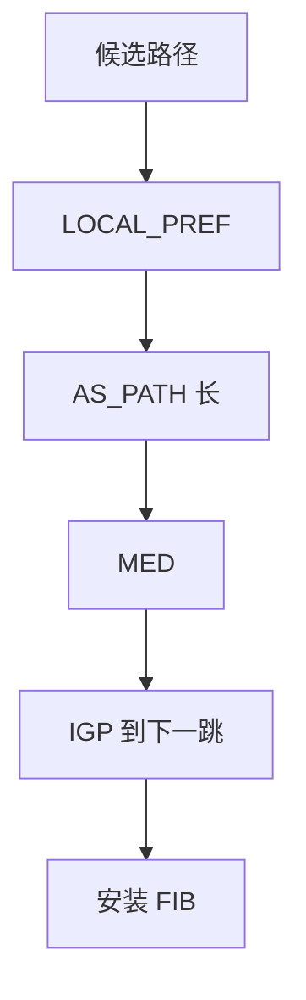

# BGP 属性与决策

同一前缀多条路径时，决策过程按 LOCAL_PREF、AS_PATH、ORIGIN、MED、eBGP vs iBGP、IGP 度量、Router ID 逐步打破平局。

<footer>—— 据 RFC 4271 第 9.1 节决策过程；Kurose and Ross BGP 属性整理</footer>

主干[AS 路径与策略](/cs/bgp-policy) 已给进出口直觉。[上一课](/cs/rip) 对照了无政策的跳数。[BGP 直觉](/cs/bgp-intuition) 不背阶梯。缺口是**属性怎么排序**：谁先谁后、哪些过 iBGP、哪些不。本课不把路由反射器写完。

## 问题

IGP 选最小代价。BGP 选「政策最佳」。典型顺序：拒无效 → 最高 LOCAL_PREF → 最短 AS_PATH → 最低 ORIGIN → 最低 MED（同 AS）→ 偏 eBGP → 最近 IGP 下一跳 → 其它平局。LOCAL_PREF 不发给 eBGP 邻居，故是 AS 内部的客户优先旋钮。MED 可对外暗示入口，邻居可无视。

不要把 AS_PATH 长度当延迟：绕远可以是故意的 LOCAL_PREF。

RFC 4271。厂商在阶梯里插入权重等私有步，课上以标准为主。Communities 是政策标签，本身不是阶梯里的一步，除非你的政策把它映到 LOCAL_PREF。

### 不是最短跳

LOCAL_PREF 内部优先于 AS_PATH。MED 可被邻居无视。下一跳必须 IGP 可达才有效。Communities 要映到阶梯才起作用。

## 方法

走一条例子：客户路由 vs 对等路由，LOCAL_PREF 已决定。再走 MED 选入口。画决策漏斗。对照 RIP：没有这些属性，无法表达合同。

方法止于选定对象与对照；机制才说它如何嵌入已有分层与主干课。

## 机制

选出的下一跳还要 IGP 可达（递归），否则无效——这把域内 SPF 与域间政策接起来。ECMP 在 BGP 里默认常关，多路径要额外开，避免环与不对称。主干 LPM 课：FIB 仍按最长前缀，BGP 只是填充某前缀的下一跳。

收敛慢：属性抖动会反复决策，后课 dampening。

## 边界

本课不引入 ADD-PATH 的全部。iBGP 与路由反射器是下一课。后课默认：eBGP 政策阶梯以 RFC 4271 为准；私有步要显式声明。

不要用 MED 当全球负载均衡：它只在同意比较的 AS 之间有意义。

上一课留下的缺口在本课收口；「BGP 属性与决策」进入后课词汇表后只引用。文献用来钉对象与边界，不把本课写成该主题的独立综述。下一课[iBGP 与路由反射器](/cs/ibgp-route-reflector)。

## 小结

- 决策是属性漏斗，不是最短跳。
- LOCAL_PREF 内部，MED 对外可被忽略。
- 下一跳必须 IGP 可达。
- 后课只引用本课钉死的对象，不从该领域总问题重开。
- 出处：RFC 4271；Kurose and Ross。
