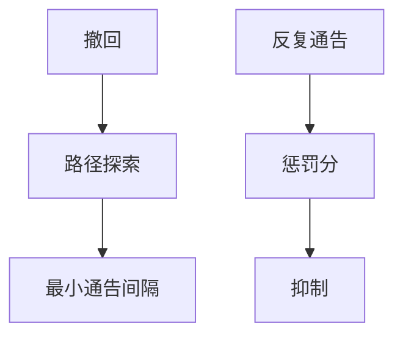

# BGP 收敛与抖动抑制

路径向量的撤回要沿图扩散，最坏可经指数条交错路径；抖动抑制给反复上下的前缀记分关小黑屋，换稳定，也换长时间黑洞。

<footer>—— 据 Labovitz et al., SIGCOMM 2000 延迟收敛；RFC 2439 路由抖动抑制整理</footer>

[上一课](/cs/ibgp-route-reflector) 让全 AS 看见前缀。缺口是**收敛要多久、抖动怎么办**：MRAI 最小通告间隔、路径探索、dampening。本课不把 RPKI 写完。

## 问题

IGP 增量 SPF 常在亚秒到秒。BGP：一条前缀的最佳路径没了，要试次优，次优也可能正被别人撤回，形成路径探索。Labovitz 等测量到分钟级延迟。MRAI 限制通告频率，减负荷也拖收敛。Dampening：前缀在惩罚分超过阈则抑制，半衰期后才用——对不稳定客户有用，对被攻击或错误抑制的前缀是人为不可达。

不要把这当成 TCP 超时：控制面不可达与数据面 RTT 是两张表。

RFC 2439。许多运营商已关默认 dampening，因伤害无辜。本课钉机制与权衡，不下令。

### 收敛以分钟为风险

路径探索加 MRAI，不像增量 SPF。抑制稳表也可能长时间藏前缀。应用要多宿主，不把 SLA 绑在全球一致。

## 方法

画：撤回 → 探索次优 → MRAI 等待 → 新通告。对照 RIP 计数到无穷：都是向量收敛慢，BGP 因政策图更不规则。卫星链路的长 RTT 再叠 MRAI，会话保活也要调。

方法止于选定对象与对照；机制才说它如何嵌入已有分层与主干课。

## 机制

RR 减少会话数，不保证更快的全球收敛：探索发生在 AS 之间。FIB 安装还有硬件延迟。与 RSTP 秒级对照：二层树小，BGP 图是互联网。端到端：应用超时往往先于 BGP 收敛，故要用多宿主与本地备选，而不是指望全球立刻一致。

## 边界

本课不引入 BGP PIC 的全部预计算。BGP 劫持与 RPKI 是下一课。后课默认：BGP 收敛以分钟为量级风险；dampening 是双刃。

测量「已收敛」要用控制面与数据面两台尺子。

上一课留下的缺口在本课收口；「BGP 收敛与抖动抑制」进入后课词汇表后只引用。文献用来钉对象与边界，不把本课写成该主题的独立综述。下一课[BGP 劫持与 RPKI](/cs/bgp-hijack-rpki)。

## 小结

- 路径探索 + MRAI 使 BGP 收敛远慢于 IGP。
- 抖动抑制稳表，也可能长时间藏前缀。
- 应用应多宿主，不把 SLA 绑在全球收敛上。
- 后课只引用本课钉死的对象，不从该领域总问题重开。
- 出处：Labovitz et al., 2000；RFC 2439。
