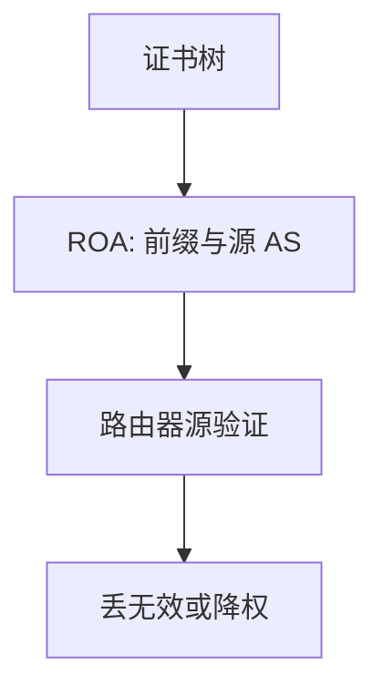

# BGP 劫持与 RPKI

任何人都可以通告「更长前缀」或更短 AS_PATH；RPKI 用证书绑定前缀与源 AS，ROV 把不匹配当无效，仍不证明整条路径。

<footer>—— 据 RFC 6480 RPKI；RFC 6811 源验证；RFC 4271 对照整理</footer>

[上一课](/cs/bgp-convergence-dampening) 假定通告是真的。缺口是**假通告**：劫持、泄露、更长前缀抢 LPM。RPKI/ROA 验**源 AS**，不是验 AS_PATH 全程。本课不把 IXP 交换结构写完。

## 问题

决策过程相信属性。攻击者向提供者通告你的 /24，全球 LPM 把流量拐走。YouTube/Pakistan 2008 一类事件是操作错误也是协议无认证。RPKI：地址局发证书，前缀持有者签 ROA（前缀、最大长度、源 AS）。路由器 ROV：未知/无效/有效三态，政策决定是否丢无效。路径上的中间 AS 仍可撒谎——BGPsec 部署稀少，本课点名不展开。

不要把 RPKI 写成 DNSSEC：对象都是证书树，验证的名字空间不同。

RFC 6480、6811。IRR 过滤是弱对照。本课不给攻击步骤，只给防御对象。

### ROV 只验源

更长前缀仍吃 LPM。ROA 不证明 AS_PATH 全程。泄露是政策错误，不是源伪造。无效当未知则保护为空。

## 方法

画：ROA 发布 → 验证缓存 → 路由器政策。对照前缀列表手工过滤：ROA 随证书更新。更长前缀：ROA maxLength 要覆盖，否则自己的拆分变无效。

方法止于选定对象与对照；机制才说它如何嵌入已有分层与主干课。

## 机制

收敛与劫持叠加：错误通告也会被探索、被 dampen。IRR 与 RPKI 可同时用。主干安全 CIA：这里主要是完整性与可用性（流量被拐、前缀被压）。机密性不在 BGP。

泄露：合法源、错误出口政策，ROA 验不过泄露路径；需要政策与监控。

## 边界

本课不引入 BGPsec 的逐跳签名部署。互联网拓扑与 IXP 是下一课。后课默认：RPKI 护源，不护路径；LPM 仍使更长前缀危险。

关闭 ROV 或把无效当未知，保护为空。

上一课留下的缺口在本课收口；「BGP 劫持与 RPKI」进入后课词汇表后只引用。文献用来钉对象与边界，不把本课写成该主题的独立综述。下一课[互联网拓扑与 IXP](/cs/internet-ixp)。

## 小结

- 劫持利用信任与 LPM，不是破密码。
- ROA+ROV 验证源 AS 与最大长度。
- 不证明 AS_PATH 真实。
- 后课只引用本课钉死的对象，不从该领域总问题重开。
- 出处：RFC 6480；RFC 6811。
