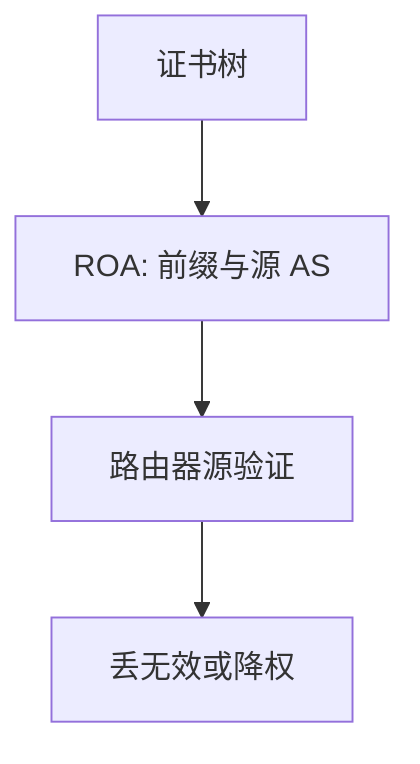
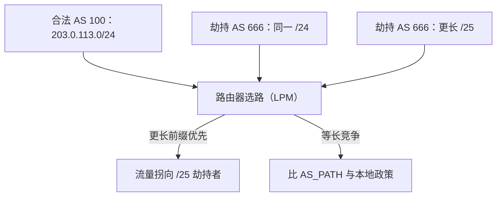

# BGP 劫持与 RPKI

任何人都可以通告「更长前缀」或更短 AS_PATH；RPKI 用证书绑定前缀与源 AS，ROV 把不匹配当无效，仍不证明整条路径。

<footer>—— 据 RFC 6480 RPKI；RFC 6811 源验证；RFC 4271 对照整理</footer>

[上一课](/cs/bgp-convergence-dampening) 假定通告是真的。缺口是**假通告**：劫持、泄露、更长前缀抢 LPM。RPKI/ROA 验**源 AS**，不是验 AS_PATH 全程。本课不把 IXP 交换结构写完。

## 问题

决策过程相信属性。攻击者向提供者通告你的 /24，全球 LPM 把流量拐走。YouTube/Pakistan 2008 一类事件是操作错误也是协议无认证。RPKI：地址局发证书，前缀持有者签 ROA（前缀、最大长度、源 AS）。路由器 ROV：未知/无效/有效三态，政策决定是否丢无效。路径上的中间 AS 仍可撒谎——BGPsec 部署稀少，本课点名不展开。

数字实例：目的地址 203.0.113.66 同时撞上 203.0.113.0/24（合法）与 203.0.113.64/25（劫持者通告），后者前缀更长、按 LPM 胜出，流量被拐走——/25 哪怕无人授权，只要没人过滤就能全球扩散。

不要把 RPKI 写成 DNSSEC：对象都是证书树，验证的名字空间不同。

RFC 6480、6811。IRR 过滤是弱对照。本课不给攻击步骤，只给防御对象。

### ROV 只验源

更长前缀仍吃 LPM。ROA 不证明 AS_PATH 全程。泄露是政策错误，不是源伪造。无效当未知则保护为空。

术语翻译：ROA 是前缀持有者签发的「授权书」，写明哪个 AS 有权广播这段地址、最长可拆到多细；ROV 则是路由器拿着授权书核对来路，对不上就判「无效」，可按政策拒收。

## 方法

画：ROA 发布 → 验证缓存 → 路由器政策。对照前缀列表手工过滤：ROA 随证书更新。更长前缀：ROA maxLength 要覆盖，否则自己的拆分变无效。

```mermaid
flowchart TD
  CER["证书树"] --> ROA["ROA: 前缀与源 AS"]
  ROA --> ROV["路由器源验证"]
  ROV --> POL["丢无效或降权"]
```

## 机制

收敛与劫持叠加：错误通告也会被探索、被 dampen。IRR 与 RPKI 可同时用。主干安全 CIA：这里主要是完整性与可用性（流量被拐、前缀被压）。机密性不在 BGP。

同一目的地址，多条通告在路由器里怎么比：

```mermaid
flowchart TD
  L["合法 AS 100：203.0.113.0/24"] --> R["路由器选路（LPM）"]
  H1["劫持 AS 666：同一 /24"] --> R
  H2["劫持 AS 666：更长 /25"] --> R
  R -->|"更长前缀优先"| W["流量拐向 /25 劫持者"]
  R -->|"等长竞争"| T["比 AS_PATH 与本地政策"]
```

常见误区：以为开了 RPKI 就万事大吉。ROV 只核对「源 AS」这一环；中间 AS 伪造路径、或合法机构把前缀从错误出口泄出去，授权书都拦不住——后者是政策错误，不是源伪造，要靠过滤与监控补。

泄露：合法源、错误出口政策，ROA 验不过泄露路径；需要政策与监控。

## 边界

本课不引入 BGPsec 的逐跳签名部署。互联网拓扑与 IXP 是下一课。后课默认：RPKI 护源，不护路径；LPM 仍使更长前缀危险。

关闭 ROV 或把无效当未知，保护为空。

下一课[互联网拓扑与 IXP](/cs/internet-ixp)。

## 小结

- 劫持利用信任与 LPM，不是破密码。
- ROA+ROV 验证源 AS 与最大长度。
- 不证明 AS_PATH 真实。
- 后课只引用本课钉死的对象，不从该领域总问题重开。
- 出处：RFC 6480；RFC 6811。
